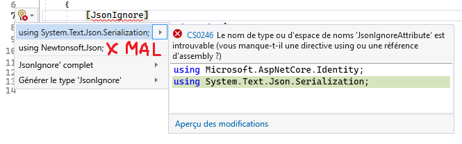

# Background Services 🦺

- .NET BackgroundService avec un Hub
- Utilisation de Scope à l'intérieur d'un service Singleton
- Erreur de **JsonIgnore...** Il faut faire attention de ne **JAMAIS utiliser** celui de **Newtonsoft**

## Info

[BackgroundService](/info/BackgroundService)

Voici également un projet de référence plus simple qui est utile pour comprendre les Background Services: [Projet GitHub Simple](https://github.com/CEM-420-5W5/SimpleBackgroundService.git)

### Exercices

[Exercice BackgroundService #1](/exercices/BackgroundService)

[Exercice BackgroundService #2](/exercices/BackgroundService2)
