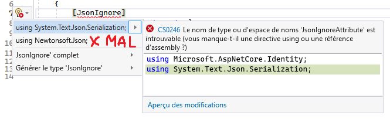

# Rencontre 23

- .NET BackgroundService avec un Hub
- Utilisation de Scope à l'intérieur d'un service Singleton
- Erreur de **JsonIgnore...** Il faut faire attention de ne **JAMAIS utiliser** celui de **Newtonsoft**

||
|-|

## Info

[BackgroundService](/info/BackgroundService)

### Exercices

[Exercice BackgroundService](/exercices/BackgroundService)
