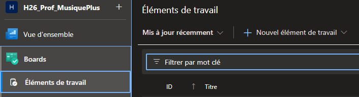
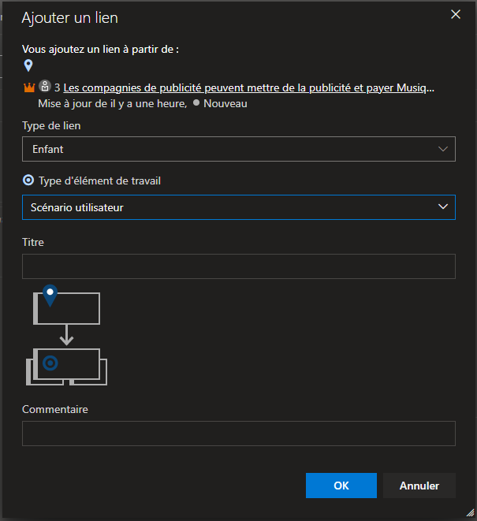

# Azure DevOps - Utilisation

### Objectif

Ce document est un complément d'information au PowerPoint :
[🔗AzureDevops.pptx](https://cegepedouardmontpetit.sharepoint.com/:p:/s/CMT420InformatiqueComitesCours-5W5/EdO0yiL8VHtNqFJRuIjpqc0BcwfAADJGKR33Iwv81O5Oyw?e=at23T4)

**Azure DevOps Boards** est un outil complexe où il y a de nombreuses façon de faire les mêmes actions. Voici donc quelques façons de l'utiliser.

[Azure Devops](https://infdevops.cegepmontpetit.ca/H26-5W5-WebAvancee)

### Ajouter une épique

- Cliquer sur nouvel élément de travail et choisir l'option "Épopée"

- Créer une première épopée

### Ajouter des user stories 

- Cliquer sur Ajouter un lien et Nouvel élément

- Choisir user storie (scénario utilisateur) et entrer le nom de la user storie (En tant que ... afin de ...)

### Ajouter des user stories au backlog (méthode alternative)

- Cliquer sur Backlogs dans menu de gauche (dans le menu Boards)
- Cliquer sur + New Work Item

- Inscrire le nom de la feature

- Vous pouvez ensuite ajouter un parent en sélectionnant élément existant et l'épique du user storie

### Ajouter une tâche

- Une fois les features complétées (User Stories ou US)
- Ajouter des tâches aux features
- Cliquer sur le + à gauche de la US

- Remplir les informations de la tâche

### Voir l'avancement par feature

- Se rendre dans l'onglet **Boards** du menu de gauche pour voir l'avancement par feature

### Voir l'avancement des tâches

- Se rendre dans l'onglet **Sprints** du menu de gauche pour voir l'avancement des tâches
- Ce sera probablement l'onglet le plus utilisé

### Créer un nouveau sprint

Une fois que le premier sprint est terminé, on va vouloir en créer d'autres.
Par défaut, les projets ont "généralement" déjà 3 sprints de créés, mais voici comment changer de sprint et en créer de nouveaux.

|  |
|-|

|  |
|-|

On peut voir quel sprint est le sprint courant et on peut également en créer de nouveaux

|  |
|-|

En changeant les dates de notre sprint, les Iteration sont correctement affichés et l'itération courante est en fonction de la date

|  |
|-|

|  |
|-|
