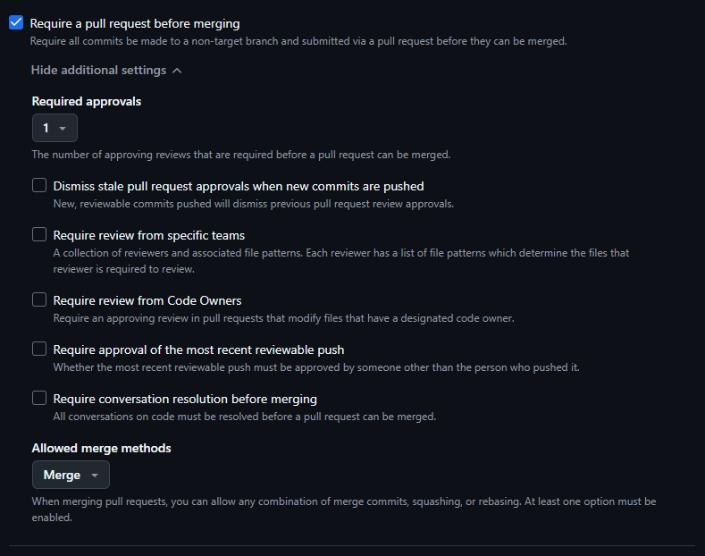
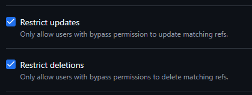

# Utilisation de GitLab

## Accéder au site

## Créer un compte avec GitHub

Valider le code de sécurité

## Première configuration

:::warning

Éviter de créer plusieurs projets

:::

## Sélectionner issues

## Inviter d'autres membres

