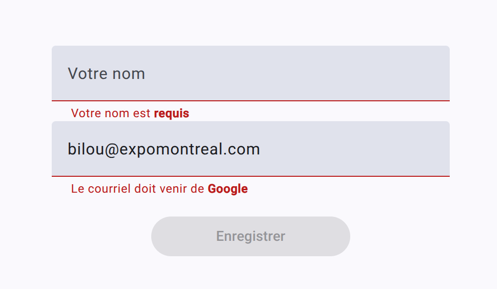

# Reactive Forms

## Objectifs

<Row>
  <Column vCenter>
    - Faire de la validation sur un ou plusieurs champs à la fois
    - Communiquer à l'utilisateur comment corriger les erreurs sur les champs
  </Column>
  <Column>
    
  </Column>
</Row>

## Création d'un premier formulaire

### Validation dynamique

- On peut afficher des messages d'erreurs directement sur les champs

### Configuration

:::warning
Il faut installer Material pour utiliser `MatInput` et `MatFormFieldModule`
:::

```powershell
ng add @angular/material
```

Les librairies suivantes vont être utilisées dans le html. Elles doivent donc être importées.

<GHCode 
  repo="5W5-Web-Avancee" 
  filePath="code/reactive-forms/src/app/app.ts" 
  language="ts" 
  startLine="14" 
  endLine="24"
/>

### Injecter FormBuilder

Il faut injecter `FormBuilder` dans le composant où l'on veut ajouter notre formulaire.

<GHCode 
  repo="5W5-Web-Avancee" 
  filePath="code/reactive-forms/src/app/app.ts" 
  language="ts" 
  startLine="24"
  ignore="25-27,29-37,41-44"
/>

### Utiliser le FormBuilder

- Créer un groupe de validation à partir du `FormBuilder`.
- Chaque champ du formulaire peut avoir un ou plusieurs validateurs.

<GHCode 
  repo="5W5-Web-Avancee" 
  filePath="code/reactive-forms/src/app/app.ts" 
  language="ts" 
  startLine="28"
  endLine="38"
  ignore="31:61-31:74,34-34,36-37"
/>

### HTML

Nous allons ajouter deux champ texte qui seront liés aux éléments du formulaire que nous venons d'ajouter.

<GHCode 
  repo="5W5-Web-Avancee" 
  filePath="code/reactive-forms/src/app/app.html" 
  language="html"
  ignore="7-11,20-31,33-35"
/>

### CSS (pour faire jolie)

Si vous suivez en même temps, vous pouvez ajouter ce CSS pour que les champs soient bien alignés et centrés.

<GHCode 
  repo="5W5-Web-Avancee" 
  filePath="code/reactive-forms/src/app/app.css" 
  language="css" 
/>

## Les Validators

- Un Validator est une fonction qui s'exécute **à chaque frappe de clavier** pour s'assurer que la valeur dans le champ est valide.
- Il existe plusieurs Validators par défaut
- Vous retrouverez les mêmes Validations que l'on peut mettre sur un modèle en C#
- Vous trouverez une documentation exhaustive des Validators offerts par Angular [ici](https://angular.dev/api/forms/Validators)

## Créer un Validator (personnalisé)

- Parfois nos besoins de validation dépassent l'offre d'Angular
- On peut créer des Validator personnalisés et les affecter à un champ du groupe

On veut valider que le courriel entré par l'utilisateur utilise gmail.

- Créer un fichier nommé `est-gmail.ts`
- Dans le fichier, ajouter le contenu suivant
- Prenenz le temps de bien lire les commentaires

<GHCode
  repo="5W5-Web-Avancee" 
  filePath="code/reactive-forms/src/app/validators/est-gmail.ts" 
  language="ts"
  startLine="3"
/>

On peut finalement ajouter la validation sur votre formulaire

<GHCode
  repo="5W5-Web-Avancee"
  filePath="code/reactive-forms/src/app/app.ts"
  language="ts"
  startLine="29"
  endLine="35"
  ignore="34-34"
/>

Pour être capable de tester nos validation, il faut ajouter ces conditions dans notre code HTML

<GHCode
  repo="5W5-Web-Avancee"
  filePath="code/reactive-forms/src/app/app.html"
  language="html"
  ignore="29:7-31,33-35"
/>

## Validator sur plusieurs champs

- On peut également utiliser un Validator personnalisé sur le formulaire pour faire une validation sur plusieurs champs
- Le cas le plus fréquent est de valider qu'un mot de passe et sa confirmation sont identiques
- Créer un fichier nommé `nom-dans-courriel.ts`
- Dans le fichier, ajouter le contenu suivant
- Prenenz le temps de bien lire les commentaires

<GHCode
  repo="5W5-Web-Avancee"
  filePath="code/reactive-forms/src/app/validators/nom-dans-courriel.ts"
  language="ts"
  startLine="3"
/>

### Exemple sur un formulaire

```ts
myCustomValidator(form: AbstractControl): ValidationErrors | null {
  // On récupère les valeurs de nos champs textes
  const email = form.get('email')?.value;
  const name = form.get('name')?.value;
  // On regarde si les champs sont remplis avant de faire la validation
  if (!email || !name) {
    return null;
  }
  // On fait notre validation
  const isValid = email.includes(name);
  return isValid ? null : { nameInEmail: true };
}
```

### form.valueChanges

- Pour récupérer les données du formulaire, nous utiliserons un Observable sur l'évènement valueChanges
- Il faudra aussi avoir créé une classe (ou une interface) du même type que le formulaire
- Il faudra finalement créer une variable du type du formulaire

```ts
// Interface qui décrit le type du formulaire
interface Data {
  email?: string | null;
  name?: string | null;
}
export class RegisterComponent implements OnInit {
  // Le component contient une variable du même type que les champs du formulaire
  formData?: Data;
  ngOnInit(): void {
    // À chaque fois que les valeurs changent, notre propriété formData sera mise à jour
    this.form.valueChanges.subscribe(() => {
      this.formData = this.form.value;
    });
  }
  //...
}
```

### setErrors

C'est également possible de mettre une erreur directement sur un control à l'intérieur d'une validation

```ts
if (error) {
  form.get("email")?.setErrors({ nameInEmail: true });
} else {
  form.get("email")?.setErrors(null);
}
```

:::danger
Prudence : `setErrors(null)` écrase toutes les erreurs existantes sur le contrôle.
:::

### Version complète

```ts
@Component({
  selector: "app-register",
  templateUrl: "./register.component.html",
  styleUrls: ["./register.component.css"],
})
export class RegisterComponent {
  form: FormGroup;
  formData?: Data;

  constructor(private fb: FormBuilder) {
    this.form = this.fb.group(
      {
        email: [
          "",
          [Validators.required, Validators.email, this.gmailValidator],
        ],
        name: ["", [Validators.required]],
      },
      { validators: this.nameInEmailValidator }
    );

    this.form.valueChanges.subscribe((v) => (this.formData = v));
  }

  gmailValidator(control: AbstractControl): ValidationErrors | null {
    const email = control.value as string | null;
    if (!email) return null;
    return email.includes("@gmail.com") ? null : { gmailValidator: true };
  }

  nameInEmailValidator(form: AbstractControl): ValidationErrors | null {
    const email = form.get("email")?.value as string | null;
    const name = form.get("name")?.value as string | null;
    if (!email || !name) return null;
    return email.includes(name) ? null : { nameInEmail: true };
  }
}

interface Data {
  email?: string | null;
  name?: string | null;
}
```

### L'utilisation de ReactiveForms dans la vue

- Ajouter le groupe de validation au formulaire HTML

```html
<form [formGroup]="form">...</form>
```

- Ajouter les champs textes

```html
<mat-form-field style="width: 100%">
  <input
    matInput
    type="text"
    placeholder="Votre nom"
    formControlName="name"
    name="name"
  />
  @if(form.get('name')?.hasError('required')) {
  <mat-error> Votre nom est <strong>requis</strong> </mat-error>
  } @if(form.hasError('nameInEmail')) {
  <mat-error> Le nom doit être dans l'adresse courriel </mat-error>
  }
</mat-form-field>
```

### formControlName="name"

- On lie le champ texte au contrôle "name" dans le groupe du formulaire (groupe de validation)

### form.get('name')?.hasError('required')

- On vérifie s'il y a une erreur de type required sur le champ

### form.hasError('nameInEmail')

- On regarde s'il y a notre erreur "custom" sur l'ensemble du formulaire

### mat-error

- On affiche un message d'erreur sous le champ texte

```html
@if(form.hasError('nameInEmail')) {
<mat-error> Le nom doit être dans l'adresse courriel </mat-error>
}
```

Version finale

```html
<div
  style="width: 100%;height: 100%; display: flex; justify-content: center; align-items: center; flex-direction: column"
>
  <mat-card class="artist-card" style="margin: 16px; padding: 16px;">
    <form [formGroup]="form">
      <mat-form-field style="width: 100%">
        <input
          matInput
          type="email"
          placeholder="Courriel"
          formControlName="email"
          name="email"
        />
        @if(form.get('email')?.hasError('email') &&
        !form.get('email')?.hasError('required')) {
        <mat-error> Entrez une adresse courriel valide </mat-error>
        } @if (form.get('email')?.hasError('gmailValidator') &&
        !form.get('email')?.hasError('email') &&
        !form.get('email')?.hasError('required')) {
        <mat-error>
          Le courriel doit venir de <strong>Google</strong>
        </mat-error>
        } @if (form.get('email')?.hasError('required')) {
        <mat-error> Le courriel est <strong>requis</strong> </mat-error>
        }
      </mat-form-field>
      <mat-form-field style="width: 100%">
        <input
          matInput
          type="text"
          placeholder="Votre nom"
          formControlName="name"
          name="name"
        />
        @if (form.get('name')?.hasError('required')) {
        <mat-error> Votre nom est <strong>requis</strong> </mat-error>
        } @if(form.hasError('nameInEmail')) {
        <mat-error> Le nom doit être dans l'adresse courriel </mat-error>
        }
      </mat-form-field>
      <button mat-raised-button color="primary" [disabled]="!form.valid">
        Enregistrer
      </button>
    </form>
  </mat-card>
</div>
```

:::danger
Un `<mat-error>` s'affiche uniquement s'il est sur un contrôle (ou formulaire) qui possède au moins une erreur. Sinon il ne sera pas rendu même si la condition `@if` est vraie.
:::

- 🔗[Solution](https://github.com/CEM-420-5W5/ngReactiveForms)
