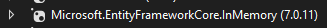

# Tests Unitaires

## Les différents types de tests (liste incomplète):

- Tests **unitaires** : vérifient le bon fonctionnement des composants individuels du logiciel.
    - Pour nos services et éventuellements nos contrôleurs.
- Tests **fonctionnels** : vérifient la conformité du logiciel aux exigences fonctionnelles.
    - Pour tester la fonctionnalité du jeu.
- Tests **de performance** : vérifient la capacité du logiciel à supporter des charges ou des contraintes.
    - Pour vérifier que l'on peut gérer un grand nombre de parties en même temps.

## Responsabilités des **contrôleurs** vs responsabilités des **services**

### Un contrôleur ça fait quoi?

- La sécurité à travers les **\[Authorize\]**
- Obtient les **données de l'utilisateur qui a fait la requête**
- Modifie les paramètres reçus pour faire les appels de services (Si nécessaire)
- Retourne les données
- Gère les exceptions et renvoi les erreurs

### Un service ça fait quoi?

- La validation des paramètres
- Les requêtes dans la BD
- La logique de l'application
- Vérification des droits d'accès aux données
    - À ne pas confondre avec \[Authorize\]. Ici on parle, par exemple, de vérifier qu'un usager n'efface pas les données d'un autre usager!
- Lance une exception lorsqu'il y a un problème


## Génération de tests

|  |
|-|

:::info
On peut utiliser cette fonctionnalité même si il n'y a pas encore de projet de tests dans la solution!
:::

## Test unitaires avec MSTest

- **\[TestClass\]** Permet d'identifier la classe comme un classe de Test
- Le **constructeur** est appelé une fois pour l'ensemble des tests de la classe
- **\[TestInitialize\]** Marque une méthode pour qu'elle soit appelée **avant** chaque test
- **\[TestCleanup\]** Marque une méthode pour qu'elle soit appelée **après** chaque test
- **\[TestMethod\]** Marque une méthode pour indiquer que c'est un **test à exécuté**

```csharp
[TestClass]
public class ServiceTests
{
    // Étape: 1
    public ServiceTests()
    {
        // Exécuter une fois pour l'ensemble des tests de la classe
    }

    // Étapes: 2 et 5
    [TestInitialize]
    public void Init()
    {
        // Exécuter AVANT chaque test
    }
    
    // Étapes: 4 et 7
    [TestCleanup]
    public void Dispose()
    {
        // Exécuter APRÈS chaque test
    }

    // Étape: 3
    [TestMethod]
    public void Test1()
    {
        // Exécution du test avec des Asserts
    }
    
    // Étape: 6
    [TestMethod]
    public void Test2()
    {
        // Exécution d'un autre test avec des Asserts
    }
}
```

:::info
Les **étapes** indiqués dans l'exemple, montre dans quel ordre les méthodes sont appelées
:::

### Comment tester une exception?

```csharp
Exception e = Assert.ThrowsException<SomeException>(() => service.DoSomething());
Assert.AreEqual("ExpectedMessage", e.Message);
```            
Il y a plusieurs façon de tester qu'un méthode lance bien une exception. En utilisant celle-ci, on peut également **valider le message de l'exception**.

## Comment tester du code qui utilise une BD?

- Pour faire nos tests facilement, nous utiliserons une BD de tests de type **InMemoryDatabase**
- Il est **IMPORTANT** que la BD est la **plus petit durée de vie possible** pour éviter des problèmes avec **Entity**
- Il est **IMPORTANT** d'effacer les données dans notre BD de tests entre 2 tests
- Il est **IMPORTANT** que la BD utilise **UseLazyLoadingProxies(true)** si c'est également le cas dans notre projet!

Il faut ajouter une libraire (Utiliser la même version que pour les librairies d'EntityFramework utilisées dans votre projet)

|  |
|-|


### Exemple de test avec InMemoryDatabase
```csharp
[TestClass]
public class CardsServiceTests
{
    // TODO Mettre seulement les optionms ici et non la BD en entier
    // La BD doit être crée et détruite pour chacun des tests, sinon il y aura des problèmes avec le tracking des éléments
    DbContextOptions<ApplicationDbContext> options;
    public CardsServiceTests()
    {
        // TODO On initialise les options de la BD, on utilise une InMemoryDatabase
        options = new DbContextOptionsBuilder<ApplicationDbContext>()
            // TODO il faut installer la dépendance Microsoft.EntityFrameworkCore.InMemory
            .UseInMemoryDatabase(databaseName: "CardsService")
            .UseLazyLoadingProxies(true) // Active le lazy loading
            .Options;
    }
    [TestInitialize]
    public void Init()
    {
        // TODO avoir la durée de vie d'un context la plus petite possible
        using ApplicationDbContext db = new ApplicationDbContext(options);
        // TODO on ajoute des données de tests
        Card[] cards = new Card[] {
          new Card
          {
              Id = 1,
              Name = "Chat Dragon",
              Attack = 5,
              Defense = 6,
              Cost = 5,
              ImageUrl = "https://i.pinimg.com/originals/a8/16/49/a81649bd4b0f032ce633161c5a076b87.jpg"
          }, new Card
          {
              Id = 2,
              Name = "Chat Awesome",
              Attack = 2,
              Defense = 4,
              Cost = 3,
              ImageUrl = "https://i0.wp.com/thediscerningcat.com/wp-content/uploads/2021/02/tabby-cat-wearing-sunglasses.jpg"
          }, new Card
          {
              Id = 3,
              Name = "Chatton Laser",
              Attack = 4,
              Defense = 2,
              Cost = 3,
              ImageUrl = "https://cdn.wallpapersafari.com/27/53/SZ8PO9.jpg"
          }
        };
        db.AddRange(cards);
        db.SaveChanges();
    }
    [TestCleanup]
    public void Dispose()
    {
        //TODO on efface les données de tests pour remettre la BD dans son état initial
        using ApplicationDbContext db = new ApplicationDbContext(options);
        db.Cards.RemoveRange(db.Cards);
        db.SaveChanges();
    }
    [TestMethod]
    public void AddValidCard()
    {
        //TODO Test classique d'une méthode de service
        using ApplicationDbContext db = new ApplicationDbContext(options);
        CardsService service = new CardsService(db);
        Card c = new Card()
        {
            Id = 4,
        };
        service.Add(c);
        Assert.AreEqual(4, db.Cards.Count());
    }
}
```

## La couverture de code

- L'objectif d'avoir une "couverture de code **complète**", c'est que chaque ligne de code de notre application soit exécuté par au moins un test.

### Outil intéressant
- Il y a un outil qui permet de voir la couverture de code directement dans Visual Studio

|  |
|-|

Dans cet exemple:
    - Les lignes de code en **bleu** sont couvertes par au moins un test
    - Les lignes de code en **rouge** ne sont pas couvertes par au moins un test
    - Pour avoir une couverture de tests complètes, il faudrait:L
        - Faire un test avec un nombre de matches plus grand que 1 (Première section rouge)
        - Faire un test avec un nombre de matches égal à 1 (Deuxième section rouge)

### Utilisation
- Pour démarrer la couverture de code, il faut sélectionner les tests qui nous intéresse
- Ensuite faire Analyser la couverture du code

:::warning
Il faut la version **Pro** pour exécuter la couverture du code. **Ça FONCTIONNE à l'école**, mais ça ne fonctionnera pas si vous avez une version **Express**.
:::

|  |
|-|

### Activiter ou désactiver la coloration du code
- Il suffit de cliquer sur un petit bouton dans les résultats de la couverture du code

|  |
|-|

## Quoi tester?
- Nous testerons uniquement les **services** et les méthodes **HasPower** et **GetPowerValue** pour le Sprint 2 **(TP2)**.
- Plus tard, **TP3**, nous allons également apprendre à écrire des tests pour nos **contrôleurs**.