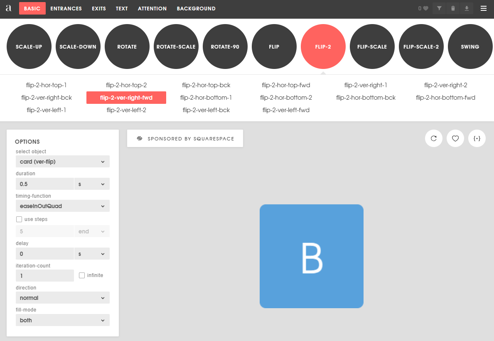

# Animations

## Vos options
On peut faire les animations en utilisant:
- CSS
OU
- Angular animations

## CSS
### Comment ça marche
- Principalement on change une propriété CSS
- On décide combien de temps de ça va prendre à faire la transition

### Exemple
- On change la propriété **top** de 0px à 20px en 0.2 seconde, voilà une animation qui fait descendre un objet de 20 pixels en 0.2 seconde.

### Keyframes
- On peut avoir différentes étapes à notre animation
- Ces étapes sont des Keyframes

### Utiliser avec Angular
- Il faut commencer par créer l'animation en CSS
```ts
@keyframes attack {
  0% {
    transform: translateY(0%);
  }
  20% {
    transform: translateY(10%);
  }
  60% {
    transform: translateY(-50%);
  }
  100% {
    transform: translateY(0%);
  }
}
```

- Ensuite on assigne l'animation à une classe CSS

```ts
.attack{
  animation: attack 0.5s;
  -webkit-animation: attack 0.5s;
  //C'est peut-être overkill de mettre toutes les autres, mais 🤷‍♂️
  -moz-animation: attack 0.5s;
  -o-animation: attack 0.5s;
  -ms-animation: attack 0.5s;
}
```

- Finalement, on peut assigner classe CSS avec une condition

```html
<app-card [class.attack]="mycard.attack===true"></app-card>
```

## Angular animations

### ng-animate
- Librairie Angular pour les animations: https://www.npmjs.com/package/ng-animate

### Exemple
```ts
@Component({
  selector: 'my-component',
  templateUrl: 'my-component.component.html',
  animations: [
    trigger('montrigger', [transition('* => *', useAnimation(bounce))])
  ],
})
export class MyComponent {
  mavariable: any;
}
```

- Dans le .hmtl
```html
<div [@montrigger]="mavariable"></div>
```

### Trigger
- C'est ce qui va permettre de déclencher l'animation
```ts
animations: [
    trigger('montrigger', 
      [transition('* => *', useAnimation(bounce))]
    )
],
```

### Transition
- C'est le changement sur la variable qui va déclencher l'animation
'* => *' signifie n'importe quel changement d'état

- On peut également mettre des ':increment' ou ':decrement'

```ts
animations: [
    trigger('bounce', [transition(':increment', useAnimation(bounce))]),
    trigger('shake', [transition(':decrement', useAnimation(shake))])
],
```

```html
<div [@shake]="mavariable" [@bounce]="mavariable"></div>
```

### useAnimation
- Dans les exemples, on utilise une animation prédéfinie, mais on pourrait également créer nos propres animations avec des keyframes


## Générateur d'animations CSS
- Le site **animista** contient des centaines d'animations que l'on peut modifier avec des paramètres pour générer nos keyframes.

[https://animista.net](https://animista.net)

||
|-|

## Délais
Quand on parle d'animation, on parle presque toujours de délais. Surtout lorsque l'on fait des séquences d'animations.

Dans l'exemple suivant, on voit que l'on set bounce à true et on le set à false après 1000 ms (donc 1 seconde).

```ts
bounceMe() {
  this.bounce = true;
  setTimeout(() => {this.bounce = false;}, 1000);
}
```

On imagine qu'une animation est délenché quand la valeur de la variable bounce change (comme dans l'exemple complet un peu plus bas.)

:::warning
Sans le **setTimeout**, l'animation joue correctement la première fois, mais comme le système détecte les changements, rien ne se passe la 2e fois que l'on clique car bounce est **ENCORE** à true.
:::

:::danger
Sans le **setTimeout**, on obtient des résultats encore **PLUS** bizarre. Par exemple, en jouant une autre animation, on risque d'avoir un **bounce** en plus à la fin car le système va réévaluer les animations après en avoir terminé une. En résumé, il faut utiliser un setTimeout de la même durée que notre animation pour remettre cette valeur à false.
:::


## Exemple
Un exemple qui montre comment utiliser à la fois des animations angular et des animations css générées avec **animista**

import Tabs from '@theme/Tabs';
import TabItem from '@theme/TabItem';

<Tabs>
  <TabItem value="app.component.ts" label="app.component.ts" default>
```ts
import { Component } from '@angular/core';
import {transition, trigger, useAnimation} from "@angular/animations";
import {bounce, shake} from "ng-animate";

@Component({
  selector: 'app-root',
  templateUrl: './app.component.html',
  styleUrls: ['./app.component.css'],
  animations:[
    trigger('bounce', [transition(':increment', useAnimation(bounce, {
      // Set the duration to 3 seconds and delay to 1 second
      params: { timing: 3, delay: 1 }
    }))]),
    trigger('shake', [transition(':decrement', useAnimation(shake))])
  ]
})
export class AppComponent {

  mavariable = 0;
  shake= false;
  bounce = false;

  constructor() {
  }

  shakeMe() {
    this.shake = true;
    setTimeout(() => {this.shake = false;},1000);
  }

  bounceMe() {
    this.bounce = true;
    setTimeout(() => {this.bounce = false;},1000);
  }
}
```
  </TabItem>
  <TabItem value="app.component.html" label="app.component.html">
```html
<div style="padding: 20px">
  <h1>Animation CSS</h1>
  <button (click)="shakeMe()" mat-raised-button color="accent" style="margin-right: 10px">Shake</button>
  <button (click)="bounceMe()" mat-raised-button color="primary">Bounce</button>
  <div [class.bounce-top]="bounce" [class.shake-top]="shake" style="height: 100px; width: 100px; background-color: aqua; margin: 20px"></div>
</div>
<div style="padding: 20px">
  <h1>Animation Angular</h1>
  <button (click)="mavariable = mavariable - 1" mat-raised-button color="accent" style="margin-right: 10px">Shake</button>
  <button (click)="mavariable = mavariable + 1" mat-raised-button color="primary">Bounce</button>
  <div [@shake]="mavariable" [@bounce]="mavariable" style="height: 100px; width: 100px; background-color: aqua; margin: 20px"></div>
</div>
```

  </TabItem>
  <TabItem value="app.component.css" label="app.component.css">
```css
.shake-top {
  -webkit-animation: shake-top 0.8s cubic-bezier(0.455, 0.030, 0.515, 0.955) both;
  animation: shake-top 0.8s cubic-bezier(0.455, 0.030, 0.515, 0.955) both;
}
/* ----------------------------------------------
 * Generated by Animista on 2023-9-7 15:7:40
 * Licensed under FreeBSD License.
 * See http://animista.net/license for more info.
 * w: http://animista.net, t: @cssanimista
 * ---------------------------------------------- */

/**
 * ----------------------------------------
 * animation shake-top
 * ----------------------------------------
 */
@-webkit-keyframes shake-top {
  0%,
  100% {
    -webkit-transform: rotate(0deg);
    transform: rotate(0deg);
    -webkit-transform-origin: 50% 0;
    transform-origin: 50% 0;
  }
  10% {
    -webkit-transform: rotate(2deg);
    transform: rotate(2deg);
  }
  20%,
  40%,
  60% {
    -webkit-transform: rotate(-4deg);
    transform: rotate(-4deg);
  }
  30%,
  50%,
  70% {
    -webkit-transform: rotate(4deg);
    transform: rotate(4deg);
  }
  80% {
    -webkit-transform: rotate(-2deg);
    transform: rotate(-2deg);
  }
  90% {
    -webkit-transform: rotate(2deg);
    transform: rotate(2deg);
  }
}
@keyframes shake-top {
  0%,
  100% {
    -webkit-transform: rotate(0deg);
    transform: rotate(0deg);
    -webkit-transform-origin: 50% 0;
    transform-origin: 50% 0;
  }
  10% {
    -webkit-transform: rotate(2deg);
    transform: rotate(2deg);
  }
  20%,
  40%,
  60% {
    -webkit-transform: rotate(-4deg);
    transform: rotate(-4deg);
  }
  30%,
  50%,
  70% {
    -webkit-transform: rotate(4deg);
    transform: rotate(4deg);
  }
  80% {
    -webkit-transform: rotate(-2deg);
    transform: rotate(-2deg);
  }
  90% {
    -webkit-transform: rotate(2deg);
    transform: rotate(2deg);
  }
}

.bounce-top {
  -webkit-animation: bounce-top 0.9s both;
  animation: bounce-top 0.9s both;
}

/* ----------------------------------------------
 * Generated by Animista on 2023-9-7 15:8:5
 * Licensed under FreeBSD License.
 * See http://animista.net/license for more info.
 * w: http://animista.net, t: @cssanimista
 * ---------------------------------------------- */

/**
 * ----------------------------------------
 * animation bounce-top
 * ----------------------------------------
 */
@-webkit-keyframes bounce-top {
  0% {
    -webkit-transform: translateY(-45px);
    transform: translateY(-45px);
    -webkit-animation-timing-function: ease-in;
    animation-timing-function: ease-in;
    opacity: 1;
  }
  24% {
    opacity: 1;
  }
  40% {
    -webkit-transform: translateY(-24px);
    transform: translateY(-24px);
    -webkit-animation-timing-function: ease-in;
    animation-timing-function: ease-in;
  }
  65% {
    -webkit-transform: translateY(-12px);
    transform: translateY(-12px);
    -webkit-animation-timing-function: ease-in;
    animation-timing-function: ease-in;
  }
  82% {
    -webkit-transform: translateY(-6px);
    transform: translateY(-6px);
    -webkit-animation-timing-function: ease-in;
    animation-timing-function: ease-in;
  }
  93% {
    -webkit-transform: translateY(-4px);
    transform: translateY(-4px);
    -webkit-animation-timing-function: ease-in;
    animation-timing-function: ease-in;
  }
  25%,
  55%,
  75%,
  87% {
    -webkit-transform: translateY(0px);
    transform: translateY(0px);
    -webkit-animation-timing-function: ease-out;
    animation-timing-function: ease-out;
  }
  100% {
    -webkit-transform: translateY(0px);
    transform: translateY(0px);
    -webkit-animation-timing-function: ease-out;
    animation-timing-function: ease-out;
    opacity: 1;
  }
}
@keyframes bounce-top {
  0% {
    -webkit-transform: translateY(-45px);
    transform: translateY(-45px);
    -webkit-animation-timing-function: ease-in;
    animation-timing-function: ease-in;
    opacity: 1;
  }
  24% {
    opacity: 1;
  }
  40% {
    -webkit-transform: translateY(-24px);
    transform: translateY(-24px);
    -webkit-animation-timing-function: ease-in;
    animation-timing-function: ease-in;
  }
  65% {
    -webkit-transform: translateY(-12px);
    transform: translateY(-12px);
    -webkit-animation-timing-function: ease-in;
    animation-timing-function: ease-in;
  }
  82% {
    -webkit-transform: translateY(-6px);
    transform: translateY(-6px);
    -webkit-animation-timing-function: ease-in;
    animation-timing-function: ease-in;
  }
  93% {
    -webkit-transform: translateY(-4px);
    transform: translateY(-4px);
    -webkit-animation-timing-function: ease-in;
    animation-timing-function: ease-in;
  }
  25%,
  55%,
  75%,
  87% {
    -webkit-transform: translateY(0px);
    transform: translateY(0px);
    -webkit-animation-timing-function: ease-out;
    animation-timing-function: ease-out;
  }
  100% {
    -webkit-transform: translateY(0px);
    transform: translateY(0px);
    -webkit-animation-timing-function: ease-out;
    animation-timing-function: ease-out;
    opacity: 1;
  }
}
```
  </TabItem>
</Tabs>

## Github

Le code de cet [exemple](https://github.com/CEM-420-5W5/ngAnimationsInfo)

