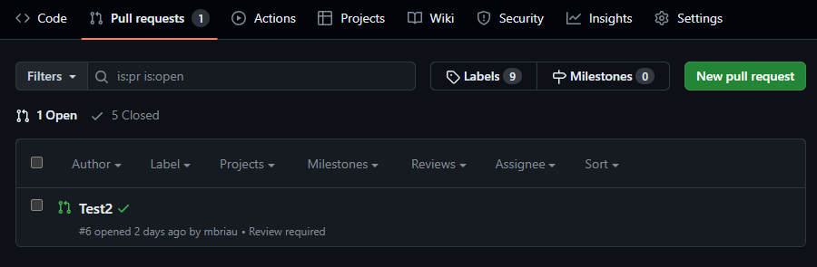

# Actions sur GitHub

## Objectif

- Apprendre à ajouter une action sur GitHub

:::info
L'exemple est une action qui roule les tests unitaires, mais il y a de très nombreuses options d'actions!
:::

## Les étapes

Pour ajouter une action à votre workflow

On va choisir une action de tests unitaires .NET (On va reparler de "Continuous integration" dans un autre cours)

Les options par défaut font bien ce que l'on veut

