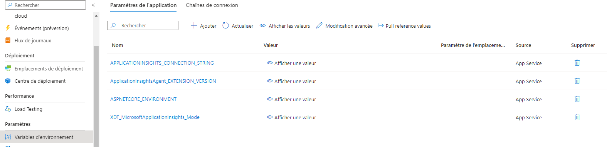

# Pull Requests

Faire un exercice qui se fait à 2 personnes et qui permet d'ajouter la protection à une branche et d'ajouter le fait de rouler les tests unitaires lorsqu'un commit est fait vers cette branche!

### Protéger une branche

### Pour tester la protecion en tant qu'admin!

### Ajout d'un test qui ne passe pas

### Un commit dans la branche du pull request va déclencher l'exécution des tests unitaires

### Une fois que le test passe

