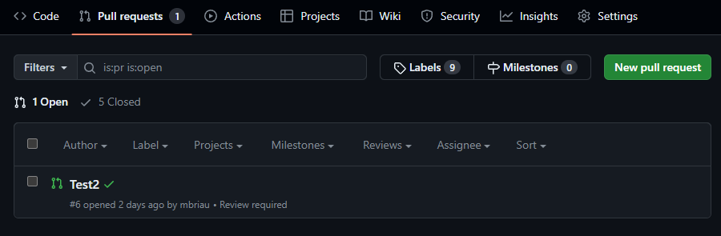
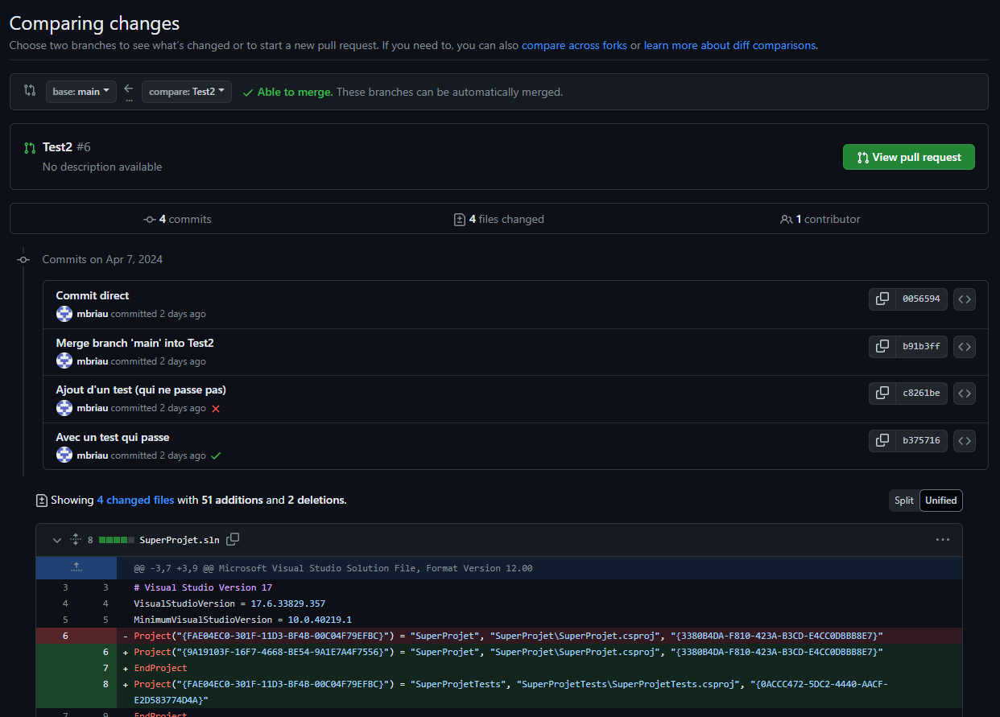

# Pull Requests

## Objectifs

- Apprendre c'est quoi un Pull Request
- Apprendre comment protéger une branche pour exiger des Pull Requests

## Un Pull Request c'est quoi?

- C'est une demande de merge d'une branche (source) vers une autre (destination).
- Une fois qu'un Pull Request est "exécuté", le merge a lieu.
- Il peut y avoir de très nombreuses conditions pour qu'un merge soit accepté. Par exemple:
    - Pas de conflit (Ça devient très utile de commencer par faire un merge de la destination dans la branche source)
    - Tests unitaires réussis
    - Review par d'autres membres de l'équipe et/ou le propriétaire du code
- Exiger un pull request, c'est une façon de protéger le code en s'assurant que les procesus sont bien mis en place
- Un projet collaboratif (OpenSource) va TOUJOURS demander des pull requests pour accepter des changements du public, sinon ça serait l'ANARCHIE!      

#### Menu Pull Requests
||
|-|

#### Menu de création de Pull Request
||
|-|

:::info
Pro Tip: On peut simplement utiliser ce menu pour comparer 2 branches!
:::

#### Menu d'un Pull Request

Dans cet exemple, il manque au moins un review et le projet ne build pas. (Mais il n'y a pas de conflit entre les 2 branches)

||
|-|

## Protéger une branche

:::info
Il est toujours possible de faire un pull request, même si une branche n'est pas protégée. Par contre, si on veut s'assurer de mettre en place une bonne façon de travailler, c'est important de configurer la règle!
:::

#### On ajoute une règle de protection à une ou plusieurs branches

||
|-|

On peut spécifier un nombre minimum de personnes qui doivent faire un review du code.
(Comme vous pouvez voir, il y a de nombreuses options)

||
|-|

### Pour tester la protecion en tant qu'admin!

Cette option empêche aux administrateurs de pouvoir forcer un PullRequest et/ou de pouvoir directement faire des push dans la branche!

||
|-|

### Ajout d'un test qui ne passe pas

Ici on peut voir de quoi à l'aire une Pull Request qui contient une action de test qui ne passe pas!

||
|-|

Dans le menu d'actions, on peut voir l'action de test qui n'a pas réussi

||
|-|

Dans les détails de cette action, on peut même voir quel test a échoué à quelle ligne

||
|-|

### Action en cours

Un commit dans la branche du pull request va déclencher l'exécution des actions (dans notre cas, des tests unitaires)

||
|-|

### Une fois que le test passe

||
|-|

:::info
Dans cet exemple, l'option d'un administrateur d'accepter une Pull Request même si les conditions ne sont pas rempli, n'a pas été désactivée.
:::

||
|-|

Il ne reste plus qu'à faire au moins un review positif pour pouvoir exécuter le Pull Request et merger la branche

