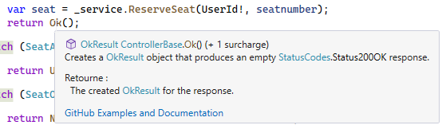

# Tester un contrôleur avec les mocks

## Tests unitaires

- On a déjà vu au Sprint 2 comment tester nos Services
- Maintenant, on apprendre à tester nos contrôleurs
- Il sera particulièrement important de tester l’API, 
    - L’API aura beaucoup plus de trafic que l’app MVC
    - Il est plus probable qu’un méchant « hacker » armé d’outils tel que Postman tente de brisé l’API

## Tester un ActionResult

Se fier au projet exemple disponible sur GitHub
[Projet GitHub de tests de résultat de contrôleur](https://github.com/CEM-420-5W5/action.result)

## Moq se retrouve dans NuGet

||
|-|

## Moq - Création

- Créer un mock
```csharp
Mock<UsersService> usersServiceMock = new Mock<UsersService>();
```
- Nous aurons donc un faux service que l’on pourra configurer
- L’option Callbase permet de mocker seulement une partie une partie de l’objet et d’utiliser le code original dans les autres cas
```csharp
Mock<TripsController> tripsControllerMock = new Mock<TripsController>() { CallBase = true };
```
- Nous pourrons ainsi utiliser des mocks avec les services du contrôleur, mais appeler les vrai actions de l’objet

:::warning
On **ÉVITE GÉNÉRALEMENT de mocker l'objet que l'on test!** On veut mocker ses dépendances! Mais le contrôleur est un cas spécial car il contient un User qui est difficile à configurer!
:::

## Moq - Configuration

- Pour que moq puisse « mocker » (simuler) une méthode ou une propriété, celle-ci doit absolument être virtual
- Moq fait des override sur nos méthodes et propriétés
- Pour configurer une méthode ou une propriété, on utilise .Setup
- Méthodes

```csharp
    mock.Setup(foo => foo.DoSomething("ping")).Returns(true);
```
- Propriétés

```csharp
mock.Setup(foo => foo.Name).Returns("bar");
```

Il est possible de configurer les paramètres que notre méthode reçoit

- It.IsAny
    - Exécute le return pour toutes les valeurs possibles
```csharp
mock.Setup(foo => foo.DoSomething(It.IsAny<string>())).Returns(true);
```

- It.Is
    - Permet de configurer une certaine plage de données
```csharp
mock.Setup(foo => foo.Add(It.Is<int>(i => i % 2 == 0))).Returns(true);
```

### Pour une fonction qui retourne null

Pour retrourner null, on peut généralement simplement RIEN FAIRE, car le comportement par défaut d'un Mock est de retourné default, donc null pour un objet. Mais si vous voulez le faire pour être clair, pour une utilisation de CallBase=true ou encore dans une séquence, il est nécessaire de faire un cast. 
```csharp
tripsServiceMock.Setup(s => s.Get(It.IsAny<int>())).Returns((Trip?)null);
```
Ou encore
```csharp
tripsServiceMock.Setup(s => s.Get(It.IsAny<int>())).Returns(value: null);
```

### Pour forcer le Mock à lancer une exception

Si l'on veut lancer une exception avec notre Mock, on peut simplement utiliser Throws à la place de Returns

Dans ce cas, un appel à DoSomething du service mocké va toujours lancer une exception de type MyException
```csharp
serviceMock.Setup(s => s.DoSomething(It.IsAny<string>())).Throws(new MyException());
```

Dans ce cas, c'est seulement lorsque l'on appel la méthode DoSomething avec 42 que l'exception se produit et elle contient un message.
```csharp
serviceMock.Setup(s => s.DoSomething(42)).Throws(new MyException("Mon Message"));
```


### Pour une fonction qui retourne void

Comme que le comportement par défaut est de rien faire lorsqu’un méthode de notre mock n’est pas configure, il n’est pas souvent nécessairement de configurer une méthode qui retourne void toutefois, c’est possible en utilisant .Verifiable
```csharp
tripsServiceMock.Setup(s => s.Delete(It.IsAny<int>())).Verifiable();
```

### La méthode Callback
Permet d’exécuter du code lorsque la méthode est appelée
Exemple, simuler une suppression
Le callback enlève un élément de la liste
```csharp
tripsServiceMock.Setup(s => s.Delete(It.IsAny<int>())).Callback((int id) =>
{
    allTrips.Remove(trip);
}).Verifiable();
```

### Utiliser le mock

La propriété .Object contient l’objet de référence qu’on peut utiliser comme l’objet normal
```csharp
tripsServiceMock.Object.Delete(1);
```
Appel la configuration qu’on a fait
```csharp
tripsControllerMock.Object.Delete()
```
Appel la vrai action Delete de notre contrôleur **SI** on avait utilisé l’option **Callbase** lors de la création


## Comment faire si une action contient le code suivant?
```csharp
User.FindFirstValue(ClaimTypes.NameIdentifier)
```

### Étape 1 
Faire une propriété pouvant être mockée dans notre contrôleur
```csharp
Public virtual string UserId { get { return User.FindFirstValue(ClaimTypes.NameIdentifier)!; } }
```

### Étape 2
Faire un mock dans nos tests du contrôleur utilisant le vrai code
```csharp
Mock<TripsController> tripsControllerMock = new Mock<TripsController>() { CallBase = true };
```

### Étape 3
Faire la configuration de la propriété UserId
```csharp
tripsControllerMock.Setup(t => t.UserId).Returns("2");
```

### Étape 4
Utiliser notre mock (Dans cet exemple, le contrôleur a retourné un **Ok** sans paramètre et le type de retour de l'action est donc **OkResult**)
```csharp
OkResult result = tripsControllerMock.Object.Delete(1)
```


## ActionResult

Lorsque l'on appel une action, le type retourné est un ActionResult\<T\> et l'on construit l'objet retourné en appelant une méthode comme **return Ok(value)** ou **return BadRequest()**

Si on porte attention, on voit qu'il n'y a **PAS de new**, on ne retourne pas un objet Ok ou BadRequest, mais on appel la méthode Ok ou BadRequest qui va créer un objet.

Si on regarde le type d'objet qui est retourné par la méthode Ok, on voit que c'est un OkObjectResult dans le cas où Ok prend une valeur.

||
|-|

Et un objet OkResult lorsqu'il n'y en a pas.

||
|-|


