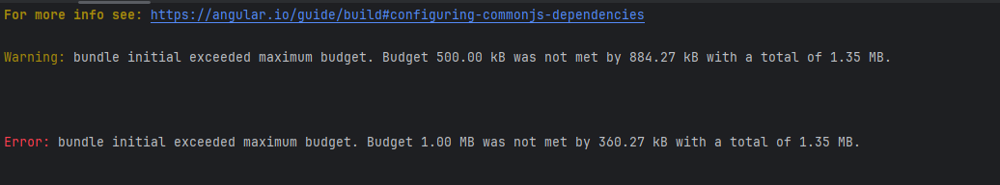

# CI/CD avec Angular

### Ajouter un # au routage
- Pour s'enlever des maux de têtes de configuration, nous allons ajouter un **#** au début de nos routes

:::warning
Sans le **hashtag**, nous ne pourrons pas avoir accès directement à une url de l'application
:::

```ts
@NgModule({
  imports: [RouterModule.forRoot(routes, { useHash: true })],
  exports: [RouterModule]
})
export class AppRoutingModule { }
```

### Ajouter des variable d'environnement
```powershell
ng generate environments
```

### Creer une variable pour l'url serveur
- Ajouter une variable dans tous les fichiers d'environnement
- Dans le fichier de developpement, nous aurons une url vers localhost
```ts
export const environment = {
    production: false,
    apiUrl: "https://localhost:7219/"
};
```

- Dans l'environnement de production, nous aurons l'url du serveur sur Azure

```ts
export const environment = {
    production: true,
    apiUrl: "https://apisupercartesinfinies.azurewebsites.net/"
};
```

:::warning
Comme on n'a pas encore déployé notre WebAPI, on n'a pas encore cette adresse, alors vous allez devoir revenir et remplir ce champ après l'avoir déployé. NOTE: La configuration WebAPI doit également connaître le URL du serveur Angular, alors c'est l'oeuf ou la poule...
:::

### Utiliser la variable d'environnement
- Maintenant, il suffit d'utiliser environment.apiUrl dans l'adresse de nos requêtes Http
- ATTENTION, importer le fichier environment et non environment.developpement

```ts
import { environment } from 'src/environments/environment';
@Injectable({
  providedIn: 'root'
})
export class ApiService {
  constructor(public http: HttpClient) { }
  async register(user: Register) {
    let player = await lastValueFrom(this.http.post<Player>(environment.apiUrl+'api/Account/Register', user));
  }
}
```

- Lors de ng serve, environment.developpement sera utilisé
- Lors d'un ng build, environment sera utilisé

### Déployer sur Azure

- Aller sur le portail Azure: https://portal.azure.com/#home

- Choisir App Services

|  |
|-|

- Créer une application web statique

|  |
|-|

- Utiliser son repo sur Github et garder l'app **gratuite!**

|  |
|-|

### Utiliser votre branche release pour le déploiement
- Dès qu'il y aura un commit sur la branche **Release**, votre application sera automatiquement redéployée
- Il sera donc important de me pas travailler sur la branche **Release**

|  |
|-|

:::info
Dans votre cas, l'organisation est probablement le compte personnel d'un des étudiants de votre équipe
:::

### Détail du build
- Avant de faire cette partie, essayer de faire un premier build de votre application Angular
```powershell
ng build
```

|  |
|-|

- Vous trouverez facilement le chemin de sortie de votre application
- Ici, c'est dist/supercartesinfinies

|  |
|-|

### Valider et créer
- La configuration est terminée, on peut créer notre application en cliquant sur **"Vérifier et créer"**
- Cliquez ensuite sur "Créer"

<!--
### Mettre à jour Git
- Aller chercher les changements qu'Azure à ajouté à votre Git
- Vous devriez avoir les dossiers .github/workflows

### Modifier le workflow
- Ouvrir le fichier .yml
- Entre le checkout du code et le déploiement

|  |
|-|

- Ajouter des lignes pour faire le npm install et le ng build

``` powershell
- name: Set up Node.js
  uses: actions/setup-node@v3
  with:
    node-version: ${{ env.NODE_VERSION }}
    cache: 'npm'
- name: npm install, build, and test
  run: |
    npm install
    npm run build --if-present
```

|  |
|-|

### Commit
- Faire un commit des changements
- Le build devrait se déclancher

-->

### Pour suivre le build
- Suivre le build sur Github avec l'onglet Actions

|  |
|-|


### Problème de budget

Si vous avez une erreur de ce genre au moment de faire votre build:

||
|-|

Il faut augmenter le budget dans le fichier **angular.json**
:::info
initiallement, le **"maximumError"** du budget **"initial"** était de **1mb** (On peut voir l'erreur qui mentionne 1.00 MB).
En le modifiant pour **2mb**, le build est maintenant un succès.
:::

``` powershell
    "configurations": {
      "production": {
        "budgets": [
          {
            "type": "initial",
            "maximumWarning": "500kb",
            "maximumError": "2mb"
          },
          {
            "type": "anyComponentStyle",
            "maximumWarning": "2kb",
            "maximumError": "4kb"
          }
```

### Lien de l'application
- Retourner à l'accueil
- Cliquer sur votre application web statique (ClientSCI dans l'exemple)

|  |
|-|

- L'URL est affiché à droite (oui, le votre va avoir un nom weird aussi)
- Copiez le URL quelque pars! Vous allez en avoir besoin pour configurer les CORS du serveur!
- Cliquez également dessus pour vérifier si votre page d'accueil Angular s'affiche bien. Si c'est le cas, on va s'occuper du serveur WebAPI.

|  |
|-|