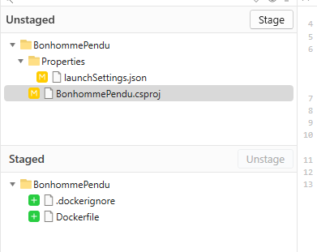

# Docker
## Ajout d'un Dockerfile pour déployer l'application

1. Dans votre solution, faites "Ajouter" sur votre projet WebAPI

||
|-|

2. Sélectionner "Prise en charge Docker..."

||
|-|

3. Cliquer sur Ok avec les options par défaut

||
|-|

4. Si vous voyez ce message, vous pouvez répondre non, on ne devrait pas avoir besoin de faire de débogage

||
|-|

5. On va seulement utiliser Docker pour notre version déployé, pas vraiment besoin de faire les modifications au .csprojet

:::info
Vous pouvez faire un commit avec les fichiers Dockerfile et .dockerignore et faire un "Discard changes" sur les 2 autres fichier
:::

||
|-|

6. Un fichier **Dockerfile** devrait avoir été généré. Il faut simplement faire un **commit** et un **push** et vous assurez que votre changement est dans la branche que vous voulez déployer (probablement **Dev**)