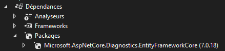
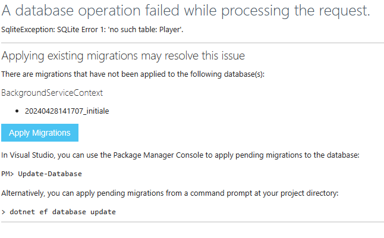

# CI/CD ASP .NET

### Changer la BD
- Nous utiliserons SQLite pour le déploiement
- C'est n'est pas particulièrement bon, mais ça nous permet de garder l'hébergement gratuit!
- Vous devrez ajouter la dépendance à Microsoft.EntityFrameworkCore.Sqlite

```csharp
builder.Services.AddDbContext<ApplicationDbContext>(options =>
{
    options.UseLazyLoadingProxies();
    // Ajouter Microsoft.EntityFrameworkCore.Sqlite
    options.UseSqlite(connectionString);
});
```

- Ajuster maintenant appsettings.json
- La connection string pour SQLite est très simple

```csharp
"ConnectionStrings": {
  "DefaultConnection": "DataSource=app.db;Cache=Shared"
},
```
- Comme c'est une technologie de BD différente, la syntaxe n'est pas exactement la même et les migrations ne sont pas compatibles entre les deux!
:::warning
Il faut également refaire les **migrations!**
:::

:::info
Comme ce n'est pas trop intéressant de travailler avec SQLite, c'est probablement une bonne idée de vous créer une branche pour le déploiement, disons "prod". Et de faire le changement de BD dans cette branche là et continuer d'utiliser MS SQL dans vos autres branches.
:::

<!--
### Outil de debug EntityFramework

En ajoutant cette configuration dans Program.cs, on va pouvoir obtenir des erreurs plus claires sur nos pages lorsqu'il y a un problème avec EntityFramework.
On va également pouvoir appliquer les migrations sur le serveur facilement.

```csharp
// Permet d'obtenir des erreurs de BD plus claires et même d'appliquer des migrations manquantes
builder.Services.AddDatabaseDeveloperPageExceptionFilter();
```

Il faut également ajouter cette libraire:

||
|-|
-->

### Ajuster les Cookies
- Nous devrons modifier les cookies pour ajuster l'option SameSite et permettre l'échange de cookies entre domaine

```csharp
builder.Services.ConfigureApplicationCookie(options =>
{
    options.Cookie.HttpOnly = false;
    options.Cookie.SameSite = SameSiteMode.None;
});
```

### Déployer sur Azure

- Aller sur le portail Azure: https://portal.azure.com/#home

- Choisir App Services

|  |
|-|

- Créer une application web

### Configuration de base
- S'assurer de choisir la bonne pile d'exécution (.net 7 probablement)
- S'assurer de garder le plan de tarification gratuit!

|  |
|-|

### Configuration du déploiement
- Cliquer pour activer le déploiement continu
- Choisir le repo du projet asp.net

|  |
|-|

### Valider et créer
- La configuration est terminée, on peut créer notre application

### Paramètres de l'app
- Retourner à l'accueil
- Cliquer sur votre application web

|  |
|-|

<!--
### Activer les messages d'erreurs
- Nous allons activer le mode développement pour être en mesure de voir les problème qui surviennent
- Cela nous permettra aussi d'appliquer les migrations
- Aller dans Configuration et ajouter un nouveau paramètre d'application

|  |
|-|

- Inscrire ASPNETCORE_ENVIRONMENT comme nom de paramètre
- Inscrire Development comme valeur
- Enregistrer les changements

|  |
|-|

### Appliquer les migrations
- Avec ASPNETCORE_ENVIRONMENT à development on pourra appliquer les migration lors de notre première connexion

||
|-|

-->

### Appliquer les migrations

Pour des raisons de sécurité, le fichier de BD que l'on a dans notre projet n'est pas directement utilisable sur le serveur déployé. Pour régler le problème, on va s'ajouter une page MVC pour **l'admin** qui va nous permettre d'appliquer les migrations.

Note: Il y a déjà un exemple (**ToolsController**) dans le projet [BackgroundService](/info/BackgroundService), dans la branche **solutionSQLite**

```csharp
public async Task<IActionResult> Index()
{
    List<string> result = (await _context.Database.GetPendingMigrationsAsync()).ToList();
    this.ViewData["pendingmigrations"] = result;

    return View();
}

[HttpGet]
public IActionResult ApplyMigrations()
{
    _context.Database.Migrate();

    return RedirectToAction(nameof(Index));
}
```

### Configurer les CORS
- Activer Access-Control-Allow-Credentials
- Ajouter l'adresse de votre application Angular
- Enregistrer le tout

|  |
|-|
