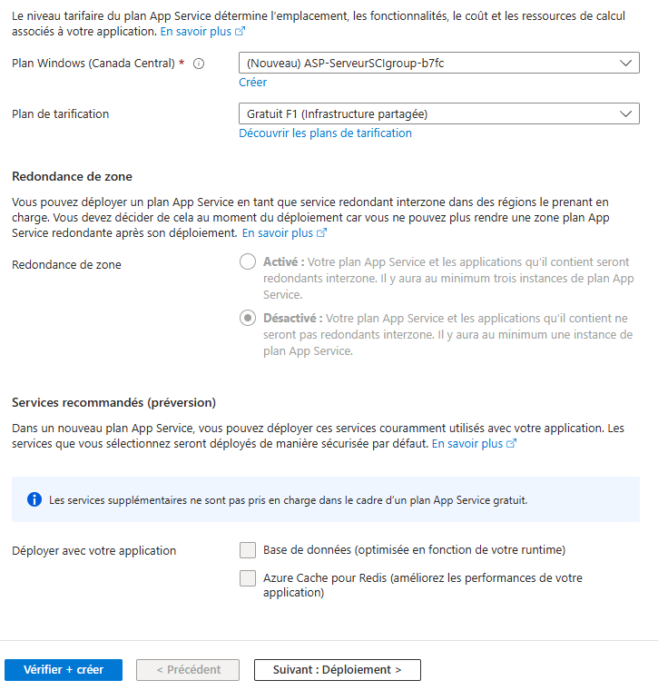

# CI/CD ASP .NET

<!--
### Changer la BD
- Nous utiliserons SQLite pour le déploiement
- C'est n'est pas particulièrement bon, mais ça nous permet de garder l'hébergement gratuit!
- Vous devrez ajouter la dépendance à Microsoft.EntityFrameworkCore.Sqlite

```csharp
builder.Services.AddDbContext<ApplicationDbContext>(options =>
{
    options.UseLazyLoadingProxies();
    // Ajouter Microsoft.EntityFrameworkCore.Sqlite
    options.UseSqlite(connectionString);
});
```

- Ajuster maintenant appsettings.json
- La connection string pour SQLite est très simple

```csharp
"ConnectionStrings": {
  "DefaultConnection": "DataSource=app.db;Cache=Shared"
},
```
- Comme c'est une technologie de BD différente, la syntaxe n'est pas exactement la même et les migrations ne sont pas compatibles entre les deux!
:::warning
Il faut également refaire les **migrations!**
:::

:::info
Comme ce n'est pas trop intéressant de travailler avec SQLite, c'est probablement une bonne idée de vous créer une branche pour le déploiement, disons "prod". Et de faire le changement de BD dans cette branche là et continuer d'utiliser MS SQL dans vos autres branches.
:::
-->
<!--
### Outil de debug EntityFramework

En ajoutant cette configuration dans Program.cs, on va pouvoir obtenir des erreurs plus claires sur nos pages lorsqu'il y a un problème avec EntityFramework.
On va également pouvoir appliquer les migrations sur le serveur facilement.

```csharp
// Permet d'obtenir des erreurs de BD plus claires et même d'appliquer des migrations manquantes
builder.Services.AddDatabaseDeveloperPageExceptionFilter();
```

Il faut également ajouter cette libraire:

||
|-|
-->

### Déployer sur Azure

- Aller sur le portail Azure: https://portal.azure.com/#home

- Choisir App Services

|  |
|-|

- Créer une application web

### Configuration de base
- S'assurer de choisir la bonne pile d'exécution (.net 8)


|  |
|-|

- S'assurer de garder le plan de tarification gratuit!

|  |
|-|

- **Cliquez sur "Suivant: Déploiement >"**

### Configuration du déploiement
- Cliquer pour activer le déploiement continu
- Choisir le repo du projet asp.net

|  |
|-|

### Valider et créer
- La configuration est terminée, on peut créer notre application en cliquant sur **"Vérifier et créer"**
- Cliquez ensuite sur "Créer"

### Modification du projet déployé!
- Si on s'arrête là, c'est le projet par défaut (et donc MVC) qui est déployé!
- On va faire une petite modification manuelle au fichier .yml qui a été créé : /.github/workflows/quelqueChose.yml
- Remplacer
```
"${{env.DOTNET_ROOT}}/myapp"
```
par
```
"${{env.GITHUB_WORKSPACE}}\myapp" "WebApi\WebApi.csproj"
```
- Remplacer
```
path: ${{env.DOTNET_ROOT}}/myapp
```
par
```
path: ${{env.GITHUB_WORKSPACE}}\myapp
```


### Paramètres de l'app
- Retourner à l'accueil
- Cliquer sur votre application web (ServeurSCI dans l'exemple)

|  |
|-|

:::danger
Peut-être que votre serveur semble ne pas fonctionner et qu'il fonctionne!!! Présentement votre serveur n'est pas en mode development, alors il n'affichera pas de Swagger!
Essayer d'accéder à l'URL où vous avez mis votre action pour mettre à jour vos migrations!
:::

### Appliquer les migrations

Pour des raisons de sécurité, le fichier de BD que l'on a dans notre projet n'est pas directement utilisable sur le serveur déployé. Pour régler le problème, on a ajouté une action pour permettre d'appliquer les migrations. (Voir la partie sur SQLite)


### Configurer les CORS
- Activer Access-Control-Allow-Credentials
- Ajouter l'adresse de votre application Angular (Que vous auriez dû copier pendant que vous avez configuré le serveur Angular)
- **Enregistrer le tout** (C'est important de cliquer sur le bouton)

|  |
|-|

### Aller mettre la bonne adresse dans la configuration du client!

- Bon, c'est le moment de retourner du côté Angular et de copier l'adresse du serveur dans l'environement!

[Configuration de l'environment Angular](/info/CICD%20Angular#utiliser-la-variable-denvironnement)

- Une fois que le client a finalement été mis à jour avec la nouvelle adresse, vous devriez pouvoir enregistrer un joueur!

<!--
### Activer les messages d'erreurs
- Nous allons activer le mode développement pour être en mesure de voir les problème qui surviennent
- Aller dans Variables d'environment et faites "Ajouter"

|  |
|-|

- Inscrire ASPNETCORE_ENVIRONMENT comme nom de paramètre
- Inscrire Development comme valeur
- Valider les changements

|  |
|-|
-->
<!--

### Appliquer les migrations
- Avec ASPNETCORE_ENVIRONMENT à development on pourra appliquer les migration lors de notre première connexion

||
|-|

-->


<!--
Note: Il y a déjà un exemple (**ToolsController**) dans le projet [BackgroundService](/info/BackgroundService), dans la branche **solutionSQLite**

```csharp
public async Task<IActionResult> Index()
{
    List<string> result = (await _context.Database.GetPendingMigrationsAsync()).ToList();
    this.ViewData["pendingmigrations"] = result;

    return View();
}

[HttpGet]
public IActionResult ApplyMigrations()
{
    _context.Database.Migrate();

    return RedirectToAction(nameof(Index));
}
```
-->

