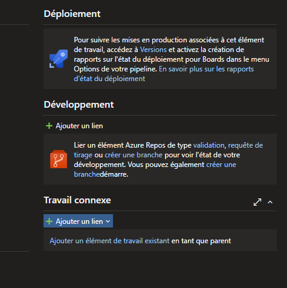
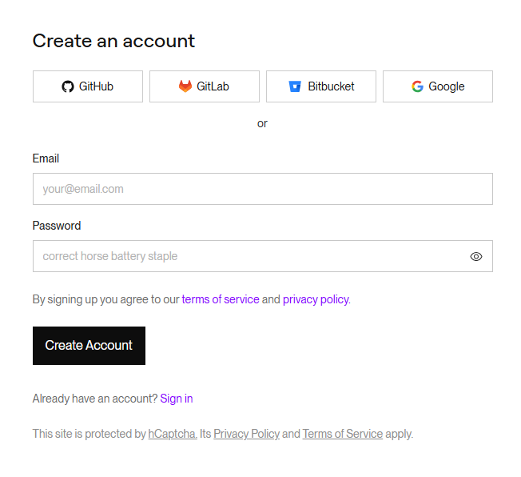
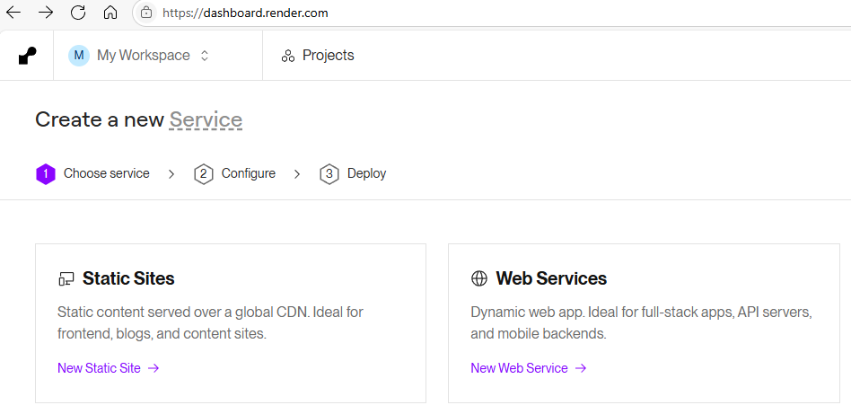
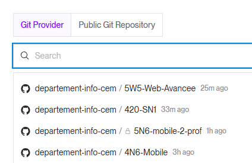
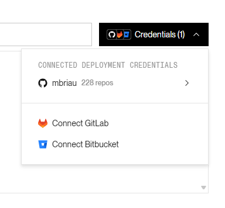
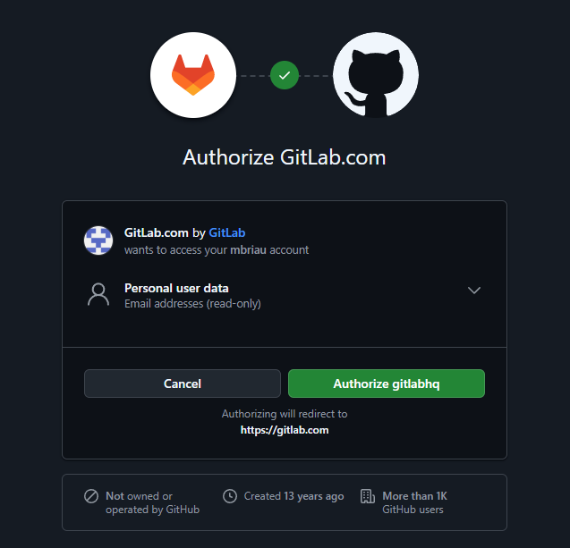
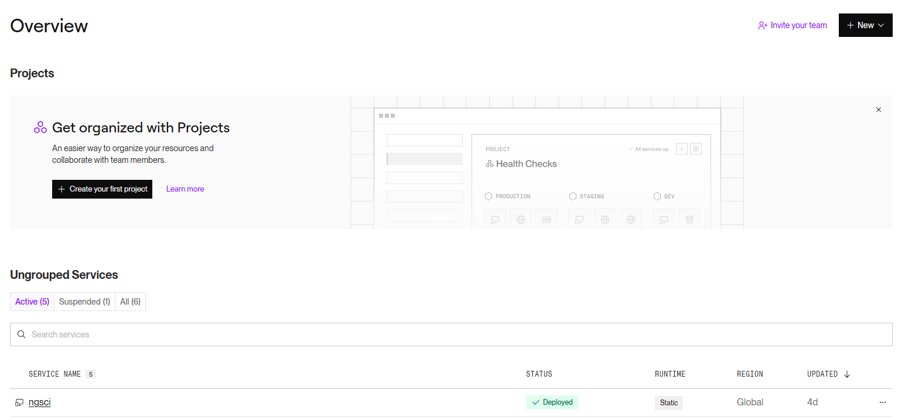
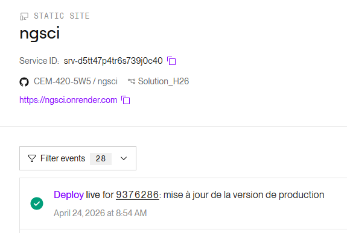

# Déployer votre application sur Render

## Commencer par se créer un compte

[Free Render](https://render.com/docs/free)

||
|-|

1. Cliquer sur "Sign up for Render"

2. Se connecter avec son compte GitHub

||
|-|

## Déployer le client (Web Services)

1. Sélectionner "Static Sites"

||
|-|

2. Il faut sélection votre projet **ANGULAR**

:::danger
Si vous ne voyez pas votre repository, il faut faire les prochaines étapes pour donner accès à votre organization et revenir à cette étape par la suite!
:::

||
|-|

3. Il faut s'assurer que le repository et/ou l'organization donne accès à Render.

:::info
Vous pouvez sauter cette étape si vous avez réussi à sélectionner votre repository
:::

Il faut:
- Cliquer sur "Credentials"

||
|-|

- Cliquer sur votre nom d'utilisateur GitHub
- Cliquer sur "Configure in GitHub"

||
|-|

4. Sélectionner votre organization

:::info
Vous pouvez sauter cette étape si vous avez réussi à sélectionner votre repository
:::

||
|-|

5. Donner accès à tout les repositories

:::info
Vous pouvez sauter cette étape si vous avez réussi à sélectionner votre repository
:::

||
|-|

6. C'est normalement pas plus compliqué de déployer sur Render (Vraiment facile si GitHub est déjà configuré)

7. Vous devez simplement attendre que le status soit déployé lorsque vous regardez vos projets

||
|-|

8. Vous voupez voir l'adresse de votre client déployé et l'état du déploiement en cliquant sur le projet

||
|-|

6. AVANT Ajouter le support de Docker
7. Dans la configuration de Render, on entre le path de Docker en dessous du répertoire du projet (mais on garde le root à la même place)

Instructions:

https://www.linkedin.com/posts/milan-jovanovic_tired-of-fighting-with-cloud-config-just-activity-7327940159390310401-bSOg

Instructions détaillées:

https://medium.com/@edawarekaro/containerizing-and-hosting-a-net-core-application-on-render-a-step-by-step-guide-4180f6a72b8b
