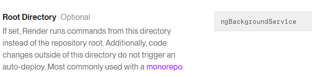
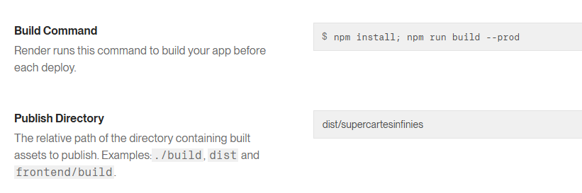
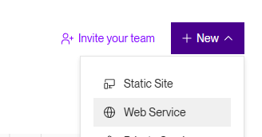
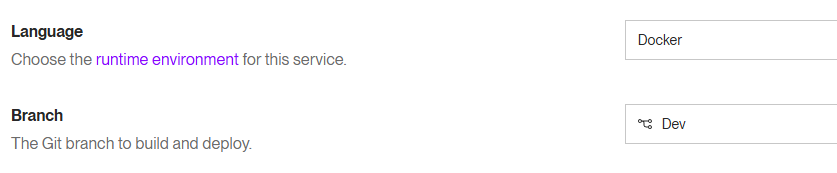
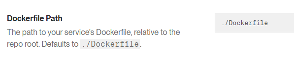
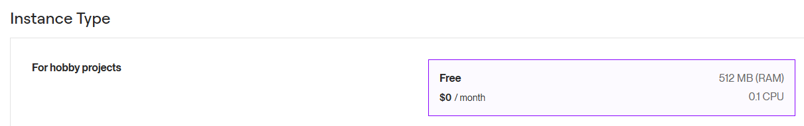
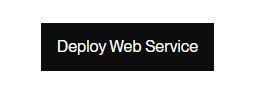

# Déployer votre application sur Render

## Commencer par se créer un compte

[Free Render](https://render.com/docs/free)

||
|-|

1. Cliquer sur "Sign up for Render"

2. Se connecter avec son compte GitHub

||
|-|

## Déployer le client (Static Site)

1. Sélectionner "Static Sites"

||
|-|

2. Il faut sélection votre projet **ANGULAR**

:::danger
Si vous ne voyez pas votre repository, il faut faire les prochaines étapes pour donner accès à votre organization et revenir à cette étape par la suite!
:::

||
|-|

3. Il faut s'assurer que le repository et/ou l'organization donne accès à Render.

:::info
Vous pouvez sauter cette étape si vous avez réussi à sélectionner votre repository
:::

Il faut:
- Cliquer sur "Credentials"

||
|-|

- Cliquer sur votre nom d'utilisateur GitHub
- Cliquer sur "Configure in GitHub"

||
|-|

4. Sélectionner votre organization

:::info
Vous pouvez sauter cette étape si vous avez réussi à sélectionner votre repository
:::

||
|-|

5. Donner accès à tout les repositories

:::info
Vous pouvez sauter cette étape si vous avez réussi à sélectionner votre repository
:::

||
|-|

6. Si votre projet se trouve dans un sous répertoire, il faut le spécifier ici (L'endroit où il y a votre package.json)

7. Il faut configurer le build de notre projet qui se fait avec npm et spécifier l'endroit où l'on déploit

:::info
Vous pouvez rouler npm run build --prod dans VSCode pour valider dans quel répertoire il met votre projet (Le build va créer un nouveau répertoire dans votre projet!)
:::

8. C'est normalement pas plus compliqué de déployer sur Render (Vraiment facile si GitHub est déjà configuré)

9. Vous devez simplement attendre que le status soit déployé lorsque vous regardez vos projets

||
|-|

10. Vous voupez voir l'adresse de votre client déployé et l'état du déploiement en cliquant sur le projet

||
|-|

## Déployer votre WebAPI (Web Services)

1. On va maintenant déployé notre serveur WebAPI

:::warning
Avant de continuer, il faut avoir générer un fichier Docker qui existe dans la branche que l'on veut déployer
:::

2. Pour ce déploiement, on va choisir Web Services et sélectionner notre repository

3. Il faut modifier le language (même si Docker n'est pas vraiment un language, mais bon...) et également la branche déployée

4. Dans la configuration de Render, on entre le path de Docker. Si vous avez un répertoire sous lequel est votre fichier Docker, il faut l'entrer dans le path ici!

5. On prendre toujours l'option gratuire

6. Vous pouvez maintenant déployer votre serveur!

:::danger
Vous allez probablement avoir une erreur au moment d'utiliser votre client à moins que vous ayez déjà pris le temps de changer l'url du serveur auquel vous vous connectez
:::

:::danger
Vous allez probablement avoir une erreur au moment d'utiliser votre client pour qu'il se connecte au serveur. Avez-vou pensé à mettre vos CORS à jour!?
:::

## Références

Instructions:

https://www.linkedin.com/posts/milan-jovanovic_tired-of-fighting-with-cloud-config-just-activity-7327940159390310401-bSOg

Instructions détaillées:

https://medium.com/@edawarekaro/containerizing-and-hosting-a-net-core-application-on-render-a-step-by-step-guide-4180f6a72b8b
