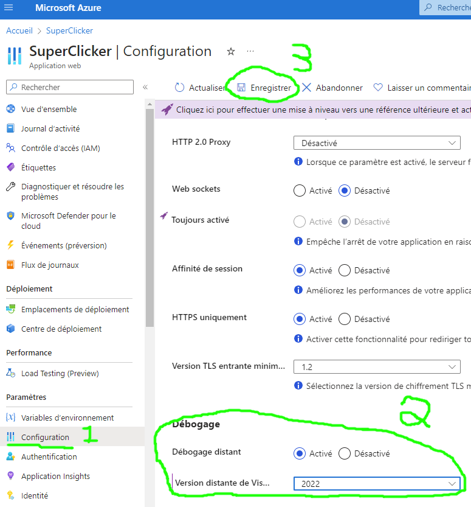
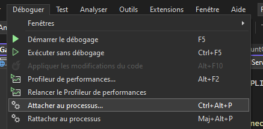
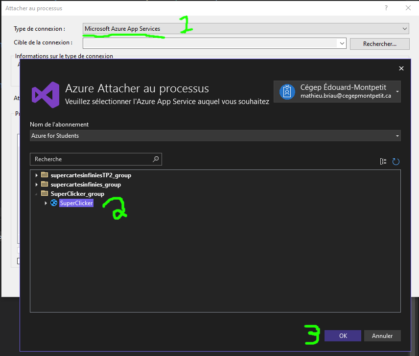

# Débogage Azure DevOps App service

## Objectif

- Apprendre comment utiliser le débogage de Visual Studio 2022 sur un serveur déployé sur Azure DevOps App Services

## Étapes

- Configurer le projet pour supporter une connection de débogage
- Connecter Visual Studio au processus
- Ajouter des points d'arrêts

### Configurer DevOps

Dans la configuration de notre application web (Serveur), on doit activé le débogage

||
|-|

N'oubliez pas d'**Enregistrer les changements**

### Connecter Visual Studio

On veut déboger en s'attachant à un processus déjà existant **(Notre serveur qui roule déjà sur le serveur d'Azure DevOps)**

||
|-|

On choisit ensuite l'option Azure DevOps et on trouve notre serveur déployé.

||
|-|

Il ne reste plus qu'à cliquer sur **Attacher** et **ajouter vos points d'arrêts**

||
|-|

### Références
[Déboguer à distance ASP.NET Core sur Azure App Service (Windows)](https://learn.microsoft.com/fr-ca/visualstudio/debugger/remote-debugging-azure-app-service?view=vs-2022)