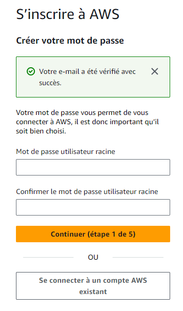
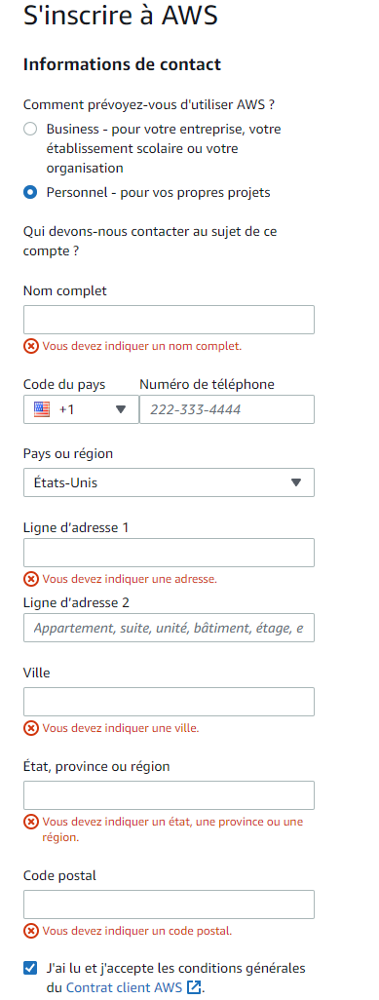
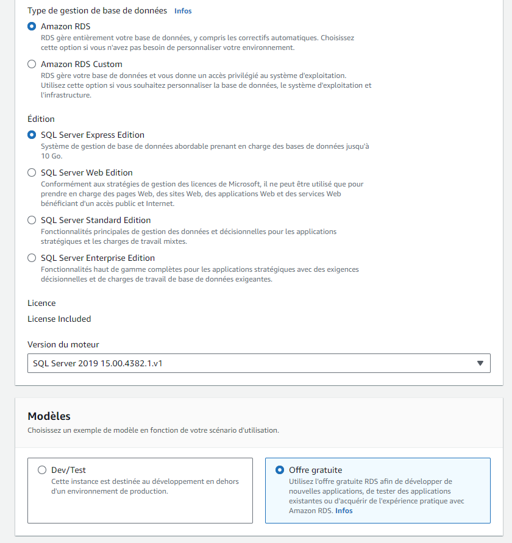

# SQLite

## Objectif

- Apprendre comment configurer votre application pour utiliser une base de données SQLite
- SQLite est une BD qui réside simplement dans un fichier local, ce n'est donc pas nécessaire de configurer un serveur pour notre BD
- L'objectif ici est de garder l'hébergement de l'application gratuite

## Étapes

- Créer une nouvelle branche
- Ajouter la librairie SQLite
- Configurer Program.cs
- Modifier appsettings.json
- Refaire les migrations
- Tester localement
- Utiliser DB Browser (SQLite)
- Ajouter une méthode WebAPI pour pouvoir appliquer notre migration (un peu hackish...)

### Créer une nouvelle branche

Il y a plusieurs bonnes raisons de **ne pas déployer** votre branche **Dev** directement. Comme vous allez utiliser SQLite, c'est encore plus important d'utiliser une autre branche.

Pour commencer, créez une nouvelle branche que vous pouvez nommer **release** ou un autre nom similaire à partir de votre branche **Dev** (Ou d'une autre branche/commit où votre application fonctionnait bien)

C'est une bonne idée de faire la même chose pour votre client.

### Ajouter la librairie SQLite

Ajoutez la librairie SQLite en utilisant la même version que pour vos autres libraires .NET

||
|-|

### Configurer Program.cs

Pour Program.cs, c'est assez simple, il faut remplacer UseSqlServer pars UseSqlite

||
|-|

### Modifier appsettings.json

Et la connection string de la BD devient encore plus simple: "DataSource=app.db;Cache=Shared"

||
|-|

### Refaire les migrations

Malheureusement, les migrations n'ont pas le même format lorsqu'on utilise SQLite. On va donc simplement les effacer et en générer de nouvelles!

:::warning
Par la suite, il va falloir faire attention si vous mergez des changements vers cette branche qui contiennent de nouvelles migrations. Vous pouvez effacer les nouveaux fichier et faire un add-migration (En conservant la bonne version du fichier de Snapshot). Ou simplement refaire encore une nouvelle migration... 🤷
:::

### Tester localement

Un petit **update-database** et vous devriez maintenant pouvoir rouler votre application sans problème!

### Utiliser DB Browser (SQLite)

Une fois que vous avez créer un joueur, prenez le temps d'installer et d'utiliser cet outil: [DB Browser for SQLite](https://sqlitebrowser.org/)

On peut ouvrir un fichier (dans notre cas le fichier **app.db** dans notre projet que l'on a configué dans **appsettings.json**) et vous allez pouvoir regarder le contenu et vous pouvez même le modifier.

### Ajouter une méthode WebAPI

Bon, un petit "hack" final pour que ça fonctionne bien. Il faut généralement re rouler l'application des migrations une fois que l'application est déployé! Pour que ça soit facile à faire on va ajouter cette action à un de nos contrôleurs!

```csharp
[HttpGet]
public IActionResult ApplyMigrations()
{
    _dbContext.Database.Migrate();
    return Ok("La BD est maintenant à jour!");
}
```

Quand votre serveur va être déployé, il faudra simplement aller à la bonne adresse pour faire exécuter vos migrations!

Pas de swagger? Comment ça? **C'est que vous avez déployé en mode production et pas development**

Donc je vais à quelle adresse? Ben quelque chose qui fait du sens avec votre contrôleur qui est probablement configué avec **[Route("api/[controller]/[action]")]**?

:::warning
Bon, normalement on expose pas trop ce genre de fonctionnalités directement accessible à tous, mais normalement on n'utilise pas SQLite pour des gros projets non plus!
:::
