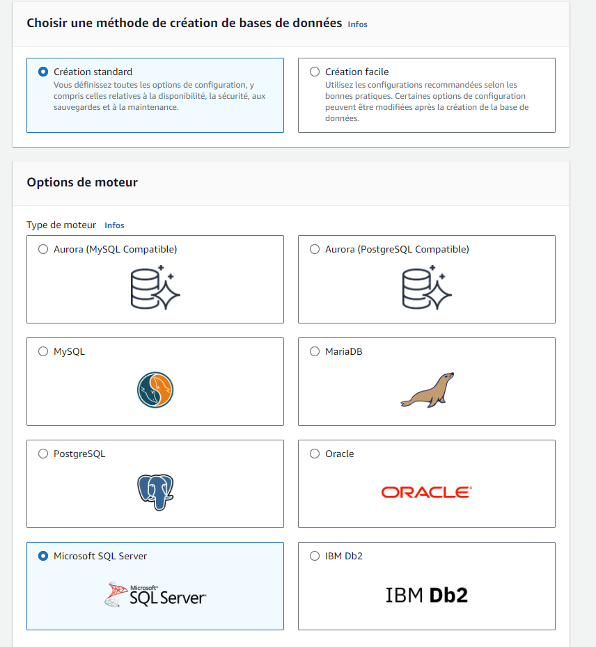
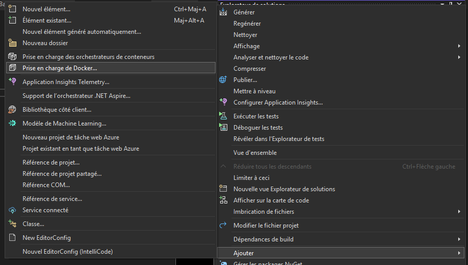
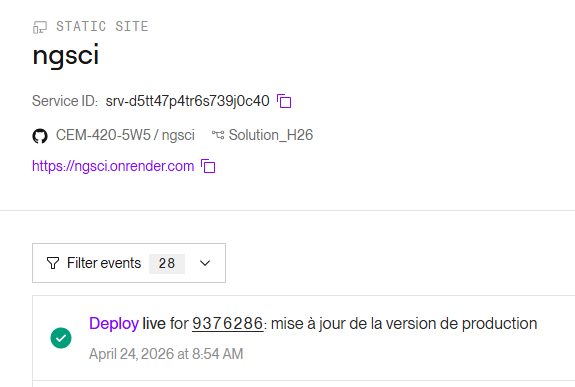

# Aws

## Objectif

L'offre gratuite de AWS (valide pour 12 mois)

:::warning
Utilisez des mots de passes que vous êtes prêt à partager avec vos coéquipiers ou votre enseignant (donc pas celui que vous utilisez pour votre compte de banque!)
:::

Mot de passe pour l'utilisateur racine (root user)

Entrer ses informations personelles

SQL Server part 1

SQL Server part 2

SQL Server Instance

SQL Server Stockage

SQL Server Accès public

Création de la BD

Configuration de régle Inbound:

