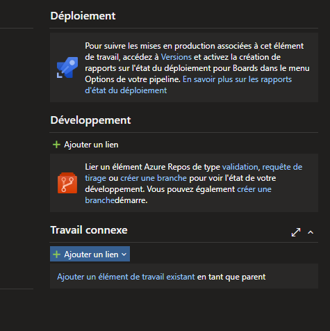
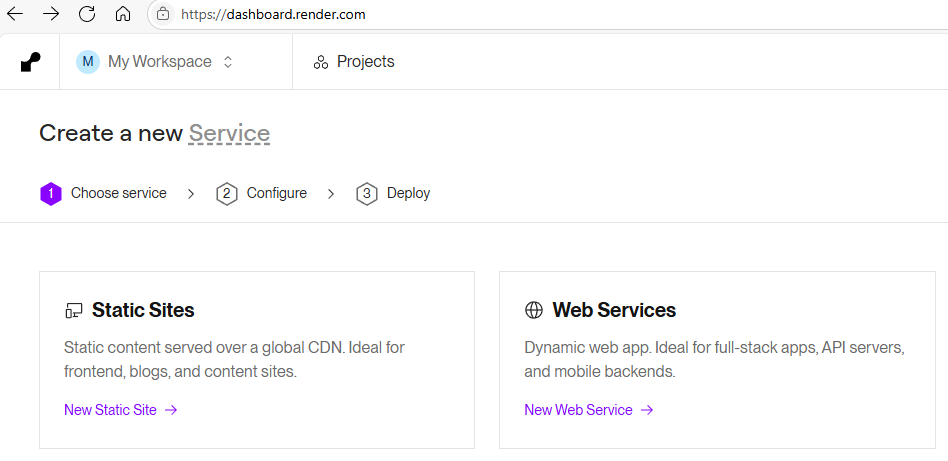
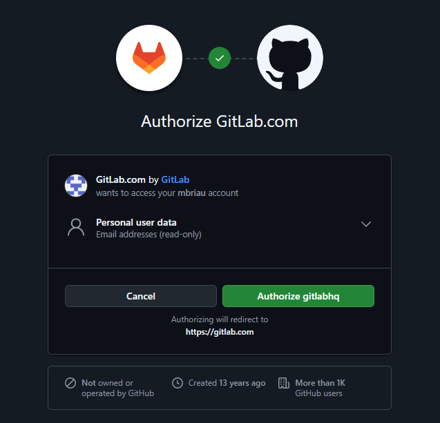
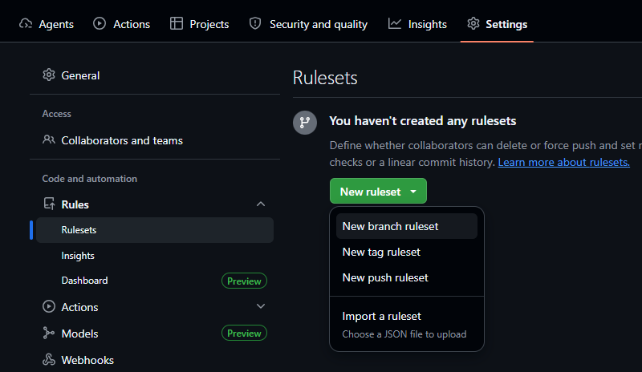
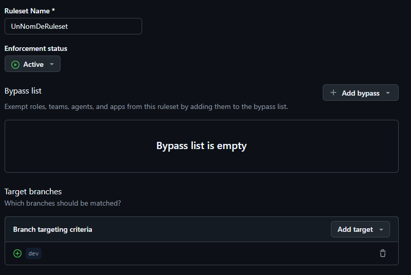

# Déployer votre application sur Render

1. Se connecter avec son compte GitHub

2. Sélectionner web Services

3. Il faut s'assurer que le repository et/ou l'organization donne accès à Render

4. Sélectionner votre organization

5. Donner accès à tout les repositories

6. AVANT Ajouter le support de Docker
7. Dans la configuration de Render, on entre le path de Docker en dessous du répertoire du projet (mais on garde le root à la même place)

Instructions:

https://www.linkedin.com/posts/milan-jovanovic_tired-of-fighting-with-cloud-config-just-activity-7327940159390310401-bSOg

Instructions détaillées:

https://medium.com/@edawarekaro/containerizing-and-hosting-a-net-core-application-on-render-a-step-by-step-guide-4180f6a72b8b
