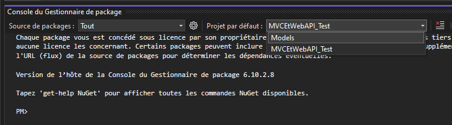

# MVC et Web API

## Objectif

Mettre en place une solution .NET qui contient 3 projets, donc 1 MVC et un Web API.

## La partie .NET

### Création d'un projet MVC

- Créez une nouvelle solution et nommez la "MVCEtWebAPI"
- Choisissez l'option qui contient le texte (modèle-vue-contrôleur). C'est la même que vous avez utilisé en 3W6.

|  |
| ------------------------ |

- Gardez la version 8
- Choisissez l'option "Comptes individuels" pour le Type d'authentification
- Par défaut, Identity est présent et fonctionnel avec l'utilisation de Cookies (Donc pas besoin de configurer Identity cette fois)
- L'interface utilisateur est générée en utilisant Identity.UI (Donc pas de UI à faire pour l'authentification MVC non plus)

### Ajout d'un projet pour nos modèles

Comme on va avoir 2 projets dans notre solution qui utilise les mêmes données, on met les données dans un projet séparé qui va être référé par ces projets.

- Créer un nouveau projet, mais à l'intérieur de la même solution!

|  |
| ------------------------ |

- Choisissez un projet de de type "Bibliothèque de classe" et donnez lui le nom "Models"

|  |
| ------------------------ |

- Effacez le fichier Class1 généré par défaut...
- Effacez également le répertoire Data/Migrations du projet MVC
- Faites un Cut + Paste des répertoires Data et Models du projet MVC vers le projet Models
- Votre solution devrait maintenant ressembler à ça:

|  |
| ------------------------ |

- On va également déplacer les dépendances et comme c'est assez long et péniblre à faire avec le UI de gestion de package, on va simplement modifier les fichiers de projet
  - Ouvrez les fichiers de projet Models et MVCEtWebAPI et déplacer toutes les dépendances SAUF celle de **Microsoft.EntityFrameworkCore.Tools**
  - Le résultat doit ressemble à ceci:

|  |
| ------------------------ |

- Lancez le projet et regardez si tout se passe bien...
- Non?? Quelle surprise?
- Il faut également ajouter la dépendance entre les deux projets.

|  |
| ------------------------ |

- Il faut simplement cocher le projet et faire OK.

|  |
| ------------------------- |

- Lancez le projet et regardez si tout se passe bien... Il devrait maintenant démarrer

### Utilisation de la BD avec plusieurs projets

Il faut maintenant créer notre migration et mettre la BD à jour.

Voici comment le faire en utilisant un projet séparé pour les données:

- Ouvrez la console du Gestionnaire de package

| ! |
| -------------------------- |

- IMPORTANT: Il faut modifier le projet par défaut de la console pour celui où se trouve ApplicationDbContext!

|  |
| ------------------------- |

- Créez la migration

```powershell
PM> add-migration initiale
```

- Créer la BD

```powershell
PM> update-database
```

- Lancez maintenant l'application est vérifiez que c'est possible de **créer un utilisateur** et de faire un **login** en utilisant les pages générées par défaut.

- Il faut simplement cliquer ici pour compléter la création de l'utilisateur.

|  |
| ------------------------- |

:::info
On a maintenant une application MVC fonctionnelle avec une authentification par **Cookie**. Dans ce cours, vous allez utiliser cette application pour gérer **les données** de votre jeu.
:::

### Ajout d'un projet WebAPI

Votre jeu va être fait avec Angular et va se connecter à un serveur WebAPI et s'authentifier par tokens. Il y aura donc 2 serveurs différents, mais pour simplifier la gestion du projet, les deux projets vont être dans la même solution. (C'est également une bonne excuse pour vous faire apprendre comment gérer plusieurs projets dans une même solution!)

:::info
C'est **possible** de rouler à la fois des contrôleurs de **WebAPI** et **MVC** sur un **même serveur**, mais ce n'est **pas possible** d'avoir **2 types d'authentification différents sur le même serveur**!
:::

- Ajoutez projet **WebAPI** à l'intérieur de la **même solution**
- Nommez-le simplement "WebAPI"
- Ne choisissez **PAS** de type d'authentification (il faut malheureusement faire la configuration de l'authentification par token nous-même...)

|  |
| ------------------------- |

- Regardez le menu en haut, il y a maintenant une nouvelle option pour choisir le projet que vous voulez lancer

|  |
| ------------------------- |

- Choisissez WebAPI et vérifiez que ça se lance bien et que vous avez maintenant

|  |
| ------------------------- |

- Créez un nouveau contrôleur nommé **AccountController** et ajoutez une méthode **PublicTest**

```csharp
[ApiController]
[Route("api/[controller]/[action]")]
public class AccountController : ControllerBase
{
    [HttpGet]
    public ActionResult PublicTest()
    {
        return Ok(new string[] { "Pomme", "Poire", "Banane" });
    }
}
```

- Testez la méthode **PublicTest** en utilisant **Swagger** (Simplement lancer votre application)

<details>


</details>

- Ajoutez une méthode PrivateTest qui contient un **[Authorize]**

```csharp
[HttpGet]
[Authorize]
public ActionResult PrivateTest()
{
    return Ok(new string[] { "PrivatePomme", "PrivatePoire", "PrivateBanane" });
}
```

- Testez la méthode **PrivateTest** en utilisant **Swagger**

|  |
| ------------------------- |

- Le message est assez clair, on a mis un [Authorize], mais on n'a aucune méthode d'authentification!

### Ajout d'une authentification par Token au projet WebAPI

Comme c'est déjà vu en 4W6, voici simplement le code **Program.cs** et pour ajouter le **Register** et le **Login** à votre AccountController pour une authentification par token.

- Ajoutez une dépendance entre **WebAPI** et le projet **Models** comme vous avez fait pour le projet **MVC**
- Ajoutez également une dépendance vers le package de **JwtBearer** (Utilisé par l'authentification par Token)

|  |
| ------------------------- |

- Ajoutez dans **Program.cs**

```csharp
var connectionString = builder.Configuration.GetConnectionString("DefaultConnection") ?? throw new InvalidOperationException("Connection string 'DefaultConnection' not found.");
builder.Services.AddDbContext<ApplicationDbContext>(options =>
    options.UseSqlServer(connectionString));

builder.Services.AddDefaultIdentity<IdentityUser>()
    .AddRoles<IdentityRole>()
    .AddEntityFrameworkStores<ApplicationDbContext>();

SymmetricSecurityKey signingKey = new SymmetricSecurityKey(Encoding.UTF8.GetBytes("C'est tellement la meilleure cle qui a jamais ete cree dans l'histoire de l'humanite (doit etre longue)"));

// TODO: Assurez-vous que c'est le bon numéro de port pour votre projet WebAPI
string serverAdress = "https://localhost:7116";

builder.Services.AddAuthentication(options =>
{
    options.DefaultAuthenticateScheme = JwtBearerDefaults.AuthenticationScheme;
    options.DefaultChallengeScheme = JwtBearerDefaults.AuthenticationScheme;
    options.DefaultScheme = JwtBearerDefaults.AuthenticationScheme;
}).AddJwtBearer(options =>
{
    options.SaveToken = true;
    // TODO: Seulement lors du developement
    options.RequireHttpsMetadata = false;
    options.TokenValidationParameters = new TokenValidationParameters()
    {
        ValidateAudience = false,
        ValidateIssuer = true,
        ValidIssuer = serverAdress,
        ValidAudience = null,
        IssuerSigningKey = signingKey
    };
});
```

- Ajoutez les using nécessaires :

```csharp
using Microsoft.AspNetCore.Authentication.JwtBearer;
using Microsoft.AspNetCore.Identity;
using Microsoft.IdentityModel.Tokens;
using MVCEtWebAPI.Data;
```

- Copiez la ConnectionString du fichier appsettings.json du projet MVC vers celui du projet WebAPI

|  |
| ------------------------- |

- Lancez l'application pour vérifier que tout fonctionne encore
- Testez encore la méthode **PrivateTest**, on veut maintenant voir: (C'est normal de ne pas avoir accès, on n'est toujours pas authentifié!)

|  |
| ------------------------- |

### Ajout des méthodes Register et Login

- Créer un répertoire DTOs dans le projet WebAPI (Les DTOs ne sont pas utiles pour le projet MVC, alors on ne va pas les mettre dans le projet Models).
- Ajoutez une classe **RegisterDTO** au projet WebAPI.

```csharp
public class RegisterDTO
{
    public string PasswordConfirm { get; set; }
    public string Password { get; set; }
    public string Username { get; set; }
    public string Email { get; set; }
}
```

- Ajout d'une action **Register** token à **AccountController**
- Attention, il faut également ajouter une injection de la dépendance **UserManager\<IdentiyUser\>**

```csharp

private readonly UserManager<IdentityUser> _userManager;

public AccountController(UserManager<IdentityUser> userManager)
{
    _userManager = userManager;
}

[HttpPost]
public async Task<ActionResult> Register(RegisterDTO registerDTO)
{

    if (registerDTO.Password != registerDTO.PasswordConfirm)
    {
        return StatusCode(StatusCodes.Status500InternalServerError, new { Error = "Le mot de passe et la confirmation ne sont pas identique" });
    }

    IdentityUser user = new IdentityUser()
    {
        UserName = registerDTO.Username,
        Email = registerDTO.Email
    };
    IdentityResult identityResult = await _userManager.CreateAsync(user, registerDTO.Password);

    if (!identityResult.Succeeded)
    {
        return StatusCode(StatusCodes.Status500InternalServerError, new { Error = identityResult.Errors });
    }

    return Ok();
}

```

- Testez en créant un nouvel utilisateur avec Swagger (Vérifiez que la réponse est bien un code 200)

- Ajoutez les classes **LoginDTO** et **LoginSuccessDTO** au projet WebAPI.

```csharp
public class LoginDTO
{
    [Required]
    public string Username { get; set; } = "";
    [Required]
    public string Password { get; set; } = "";
}

public class LoginSuccessDTO
{
    [Required]
    public string Token { get; set; } = "";
}
```

- Injectez un **SignInManager**

```csharp
private readonly UserManager<IdentityUser> _userManager;
private readonly SignInManager<IdentityUser> _signInManager;

public AccountController(UserManager<IdentityUser> userManager, SignInManager<IdentityUser> signInManager)
{
    _userManager = userManager;
    _signInManager = signInManager;
}
```

- Ajout d'une action **Login** token à **AccountController**

```csharp
[HttpPost]
public async Task<ActionResult> Login(LoginDTO loginDTO)
{
    var result = await _signInManager.PasswordSignInAsync(loginDTO.Username, loginDTO.Password, true, lockoutOnFailure: false);

    if (result.Succeeded)
    {
        Claim? nameIdentifierClaim = User.Claims?.FirstOrDefault(x => x.Type == ClaimTypes.NameIdentifier);

        // Note: On ajoute simplement le NameIdentifier dans les claims. Il n'y aura pas de rôle pour les utilisateurs du WebAPI.
        List<Claim> authClaims = new List<Claim>();
        authClaims.Add(nameIdentifierClaim);

        SymmetricSecurityKey signingKey = new SymmetricSecurityKey(Encoding.UTF8.GetBytes("C'est tellement la meilleure cle qui a jamais ete cree dans l'histoire de l'humanite (doit etre longue)"));

        string issuer = this.Request.Scheme + "://" + this.Request.Host;

        DateTime expirationTime = DateTime.Now.AddMinutes(30);

        JwtSecurityToken token = new JwtSecurityToken(
            issuer: issuer,
            audience: null,
            claims: authClaims,
            expires: expirationTime,
            signingCredentials: new SigningCredentials(signingKey, SecurityAlgorithms.HmacSha256Signature)
        );

        string tokenString = new JwtSecurityTokenHandler().WriteToken(token);

        // On ne veut JAMAIS retouner une string directement lorsque l'on utilise Angular.
        // Angular assume que l'on retourne un objet et donne une erreur lorsque le résultat obtenu est une simple string!
        return Ok(new LoginSuccessDTO() { Token = tokenString });
    }

    return NotFound(new { Error = "L'utilisateur est introuvable ou le mot de passe ne concorde pas" });
}
```

:::warning

Chaque année, de pauvres étudiants perdent beaucoup de temps en retournant une simple string dans un contrôleur WebAPI. Ça fonctionne bien dans Swagger ou Postman et ce n'est pas une erreur en soi, mais Angular assume que la valeur retournée est du JSON (donc un objet ou un array) et donne une erreur de parsing JSON. Essayez de ne pas être la victime de ce problème, retournez toujours un DTO, un array ou une string JSON.

:::

- Testez la méthode **Login** avec **Swagger**


Même si vous testez la méthode private **APRÈS** un **Login**, ça ne va pas fonctionner...

C'est "normal", il faudra fournir le token lors de l'appel! (Vu au prochain cours)

Mais c'est terminé pour aujourd'hui! Au prochain cours, vous allez continuer à travailler avec la **MÊME solution**, alors assurez-vous de la **conserver quelque pars**!
