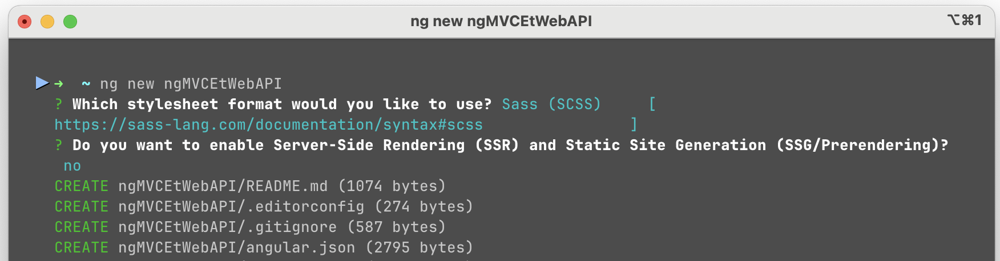

# Authentification par token

:::warning

Suite de l'exercice précédent: MVCEtWebAPI

:::

## Objectifs

- Ajouter la possibilité d'utiliser un token avec Swagger

- Créer un projet angular qui permet de se connecter à l'API Web en utilisant une authentification par token

## .Net

### Ajouter l'utilisation de token avec Swagger

Cette partie est seulement pour **vous aider à tester** vos applications.

:::info
C'est possible d'utiliser un outil comme **Postman** à la place de Swagger et de spécifier les tokens pour faire nos tests.
:::

Dans **Program.cs**, modifier l'appel à la méthode **AddSwaggerGen**

```csharp
// Ajout d'un support pour les tokens dans Swagger
builder.Services.AddSwaggerGen(opt =>
{
    opt.SwaggerDoc("v1", new OpenApiInfo { Title = "MyAPI", Version = "v1" });
    opt.AddSecurityDefinition("Bearer", new OpenApiSecurityScheme
    {
        In = ParameterLocation.Header,
        Description = "Please enter token",
        Name = "Authorization",
        Type = SecuritySchemeType.Http,
        BearerFormat = "JWT",
        Scheme = "bearer"
    });

    opt.AddSecurityRequirement(new OpenApiSecurityRequirement
    {
        {
            new OpenApiSecurityScheme
            {
                Reference = new OpenApiReference
                {
                    Type=ReferenceType.SecurityScheme,
                    Id="Bearer"
                }
            },
            new string[]{}
        }
    });
});
```

- Faites un register et un login avec un utilisateur en utilisant Swagger
- Copiez le token qui a été reçu par l'appel au login (Copiez tout le contenu de la réponse, mais faites attention de garder seulement le token à la prochaine étape!)

||
|-|

- Cliquez sur le cadenas ouvert pour spécifier le token

||
|-|

:::warning
Faites attention d'effacer le " \} à la fin et le \{   "token": " au début
:::

- Testez maintenant PrivateTest, vous devriez normalement obtenir un code 200

||
|-|


## Angular

C'est le moment de réviser Angular! Les prochaines étapes sont moins détaillées, sauf pour ce qui est nouveau!

- Lorsque vous aurez terminé, votre application devrait ressembler à ceci (Les détails ne sont pas important)

Après avoir fait un appel publique sans être connecté:

||
|-|

Après s'être connecté et avoir fait un appel privé:

||
|-|

### Tester un appel de base
- Créer un client Angular

```powershell
ng new ngMVCEtWebAPI --no-standalone
```

A FAIRE: Image de la création de projet Angular
||
|-|

:::info
Pourquoi --no-standalone? C'est une option pour continuer d'utiliser l'import pars Module avec laquelle vous êtes déjà familliés.
:::

- Après utiliser cette commande pour démarrer le serveur Angular

```powershell
ng serve --ssl -o
```

:::info
Pourquoi --ssl? C'est une option pour rouler le serveur avec https, c'est nécessaire pour avoir une authentification sécuritaire.
:::

- Faites une page très simple avec simplement 2 boutons "TestPublic" et "TestPrivate"
- Créer des méthodes pour vous permettre d'appeler votre serveur web API en cliquant sur les boutons.
- Vous pouvez simplement ajoutez un section résultat sur la page et afficher le résultat du dernier appel au serveur.
- L'appel à la fonction publique ne fonctionne probablement pas avec une **exception** à propos des **CORS**. Pourquoi? Vous faites un appel à partir d'un autre site!
- Modifiez Program.cs pour ajouter le droit d'accès **CORS à localhost:4200**

La modification **AVANT builder.Build()**
```csharp
builder.Services.AddCors(options =>
{
    options.AddPolicy("CorsPolicy", builder => builder
        .WithOrigins("https://localhost:4200")
        .AllowAnyMethod()
        .AllowAnyHeader());
});
```

La modification **AVANT app.UseHttpsRedirection()**
```csharp
app.UseCors("CorsPolicy");
```

- Vérifier que la publique fonctionne maintenant
- Vérifier que la privée donne une erreur 401

### Ajouter l'authentification
- Ajouter un bouton pour s'enregistrer
- Ajouter un bouton pour se connecter
- Pour les appels au serveur vous pouvez utiliser un username, email et password hardcodés pour garder ça simple (ou permettre de modifier le username comme dans l'exemple...)

- Lorsque vous obtenez le résultat de votre appel à Login, il faut sauvegarder la valeur dans votre session!
- Utiliser le sessionStorage pour sauvegarder le token:

```ts
sessionStorage.setItem("token", result.token);
```

:::info
Pour nous permettre de facilement ouvrir plusieurs fenêtre pour des joueurs différents lorsque l'on va tester notre jeu, on va préférez utiliser sessionStorage pour stocker nos tokens!
:::

- Tester la fonction privée, faites attention d'inclure le token qui est maintenant dans sessionStorage en utilisant sessionStorage.getItem("token")

```ts
let token = sessionStorage.getItem("token");
```

- Ajoutez un bouton logout qui fait simplement

```ts
sessionStorage.removeItem("token");
```

- Testez que l'appel à la fonctionne privée ne fonctionne plus
- Tester que l'appel fonctionne après un nouveau login!

- Pour éviter de compliquer chacun des appels au serveur, utilisez un interceptor comme vous aviez déjà vu en 4W6. Vous pouvez simplement vérifier si il y a un token dans le sessionStorage et l'inclure si il n'est pas null!

- Oui, oui, prenez vraiment le temps d'ajouter un interceptor, ça vaut la peine et vous allez l'utiliser toute la session!

### Ajouter un modèle et un contrôleur MVC

- Ajoutez un nouveau modèle et nommez le **TestData**. On va continuez d'utiliser Entity Framework, alors il faut que le modèle est un **Id**
- Ajoutez également une propriété **Name**
- ATTENTION: Comme c'est un modèle, ajoutez la classe dans le projet **Models**. Il va être utilisé par les 2 autres projets.

- Ajoutez un contrôleur pour faire les actions CRUD sur **TestData**


- Assurez-vous de pouvoir ajouter une entrée **TestData** avec les pages générés. (L'image affiche le résultat après avoir ajouté une entrée)


:::info
N'oubliez pas de faire une migration et de mettre la BD à jour. Il y a les détails sur comment faire dans l'exercice précédent!
:::

- Ajoutez un \[Authorize\] au contrôleur que vous avez créé. 

```csharp
[Authorize]
public class TestDatasController : Controller
```

- Vérifiez que vous devez maintenant être connecté avec un utilisateur pour utiliser le contrôleur

### Ajouter une action Web API et l'utiliser dans Angular

- Ajoutez un contrôleur **TestDataController** Web API à votre projet WebAPI
- Ajoutez une action CreateData et un CreateTestDataDTO avec simplement une propriété Name. Protégez la avec **\[Authorize\]**

```csharp
public class CreateTestDataDTO
{
    public string Name { get; set; }
}
```

- Dans l'action, créez une nouvelle instance de TestData avec le bon nom et sauvegardez la dans la BD

- Testez l'action dans Swagger (Il va falloir utiliser un token après un login si vous avez bien mis un **\[Authorize\]**)

- Ajoutez un formulaire à votre page Angular qui vous permet d'ajouter une nouvelle entrée TestData. Quelque chose d'assez simple comme ceci:


:::info
Si vous avez bien fait la partie sur l'authentification avec l'intercepteur, l'appel devrait fonctionner après avoir fait un login.
:::

:::warning
Pour l'instant, on ne fait aucune vérification de la validité de durée de vie de notre Token! Si ça ne fonctionne pas, essayez de faire un Logout et un Login!
:::

- Finalement, utilisez la page MVC pour vérifier que le data que vous ajoutez avec Angular est bien présent dans la BD!


