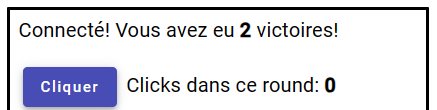
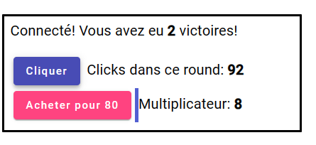

# .NET BackgroundService

## Objectifs
- Comprendre l'exemple qui utilise un BackgroundService [voir info](/info/BackgroundService)

## Étapes

Commencer par mettre en place le projet.

[Projet GitHub](https://github.com/CEM-420-5W5/BackgroundService)

**ATTENTION:** Le client doit être roulé avec **ng serve --ssl**, car on utilise l'authentification par cookie!

Une fois que vous avez fait fonctionner l'exemple et que vous avez bien compris comment il fonctionne, on veut ajouter les 2 fonctionnalités suivantes:

### Ajout d'un NbWins pour les joueurs

Ça serait intéressant de sauvegarder le nombre de victoires des joueurs.

Donc chaques fois que l'on termine un Round dans notre BackgroundService **Game**, on va obtenir les Players qui ont gagnés et incrémenté le nombre de victories (NbWins)

Une fois que c'est fait, on va vouloir également afficher ça sur le client.

Il y a de nombreux TODOs dans le code pour vous aider à faire cette tâche.

Une fois que c'est fonctionnel, on veut voir quelque chose comme ça:

### Ajout d'un mutliplicateur (multiplier)

Un mutliplier permet d'augmenter le score de plusieurs points à chaque click. Donc si le multiplier est à 4, le joueur gagne 4 points à **chaque** click.

Un mutltplier coûte des points (Le joueur fait baisser son score pour augmenter son multiplier). Le premier multiplier coût 10 points.

Quand on augmente le multiplier, il DOUBLE à chaque fois 1 devient 2, 2 devient 4, qui devient 8, 16, 32, 64, 128..... etc.

Le coût du multiplier augmente de la même façon! Donc acheter le multiplier 32 (alors qu'on est déjà à 16), coûte 160 points! (Mais par la suite, chaque click donne 32 points, une AUBAINE)

:::warning
À la fin d'un round, le multiplier REDEVIENT 1! Comme ça, c'est équitable pour les joueurs qui viennent tout juste de commencer à jouer!
:::

Encore une fois, il y a de nombreux TODOs dans le code pour vous aider à faire cette tâche.

Une fois que c'est fonctionnel, on veut voir quelque chose comme ça:

:::info
Si vous jouez bien, vous devriez être capable d'atteindre plus de 50,000 points en 30 secondes!
:::

:::warning
Comme c'est un jeu simple et que ça va vite, j'ai utilisé la technique de faire les actions à la fois sur le client et le serveur en parallèle. On n'attend pas la réponse du serveur pour augmenter le score ou le multiplicateur! Ce n'est pas une solution qui est toujours appropriée, disons que c'est un sujet assez complexe, mais dans la pluspart des logiciels sur lesquels vous allez travailler, c'est probablement mieux de ne pas utiliser cette technique... Sauf si l'interactivité est très importante!
:::

### Solution

Il y a une branche **solution** dans le projet
