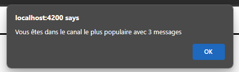

# .NET BackgroundService #2

## Objectifs
- Ajouter un **BackgroundService** à l'exerice [SignalR, 2e partie](/exercices/SignalR2)

## Étapes

Continuer l'exercice sur **SignalR, 2e partie** disponible ici: 

[Projet GitHub avec Client et Serveur](https://github.com/CEM-420-5W5/SignalR_2)
(il existe une branche solution à partir de laquelle vous pouvez commencer cette partie)

Une fois que vous avez fait fonctionner l'exemple et que vous avez bien compris comment il fonctionne, on veut ajouter les choses suivantes:

### Ajout d'un NbMessages sur la classe Channel (sur le serveur)

On ne sauvegardera pas les messages, mais seulement la quantité.

On va donc ajouter une propriété NbMessages sur la classe Channel **(N'oubliez pas de faire une migration)**

On va ensuite incrémenter la valeur chaque fois qu'un message est envoyé avec sur un channel avec la méthode SendMessage.

N'oubliez pas de faire un SaveChangesAsync()

### Ajout d'un BackgroundService

Suivre les instructions pour ajouter un BackgroundService avec le nom de votre choix. (N'oubliez pas de l'ajouter dans **Program.cs**)

Le BackgroundService doit faire la chose suivante chaque 30 secondes:
    - Trouver le canal le populaire (Vous **pouvez** décider de gérer le cas où il y a plusieurs canaux avec une égalité pour la première place)
    - Envoyer un message **MostPopularChannel** avec la quantité de messages au(x) groupe(s)

:::info
Il faut donc utiliser un **scope** pour obtenir le **DbContext** et un **IHubContext** pour envoyer le message.
:::

### Ajout d'une méthode qui écoute le message sur le client

Sur le client, une alert du genre devrait s'afficher lorsqu'un utilisateur est connecté au canal le plus populaire:

||
|-|

### Solution

Il y a une branche **backgroundService** dans le projet avec la solution
(La branche solution, c'est la solution de la partie sur SignalR sans BackgroundService)
