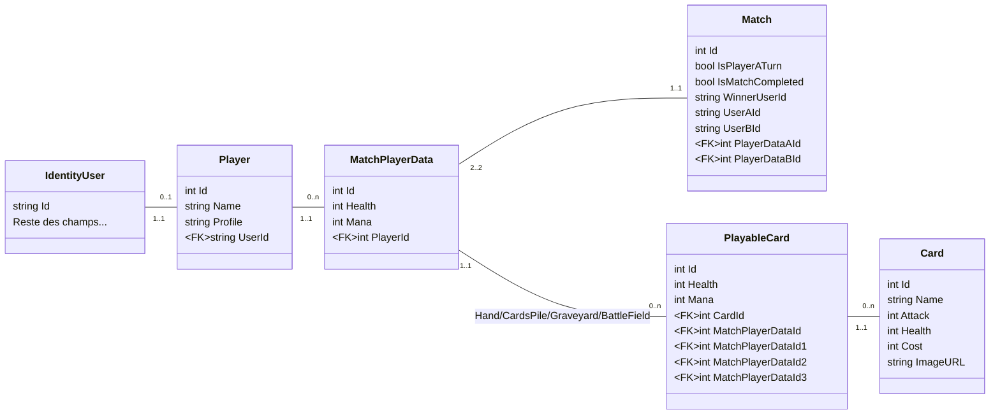
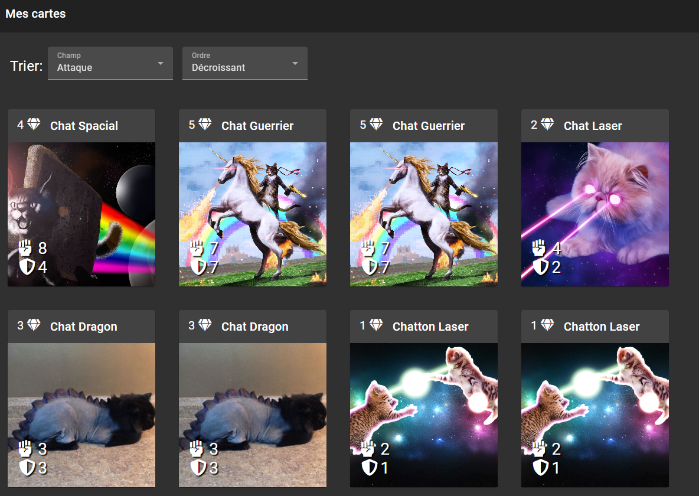
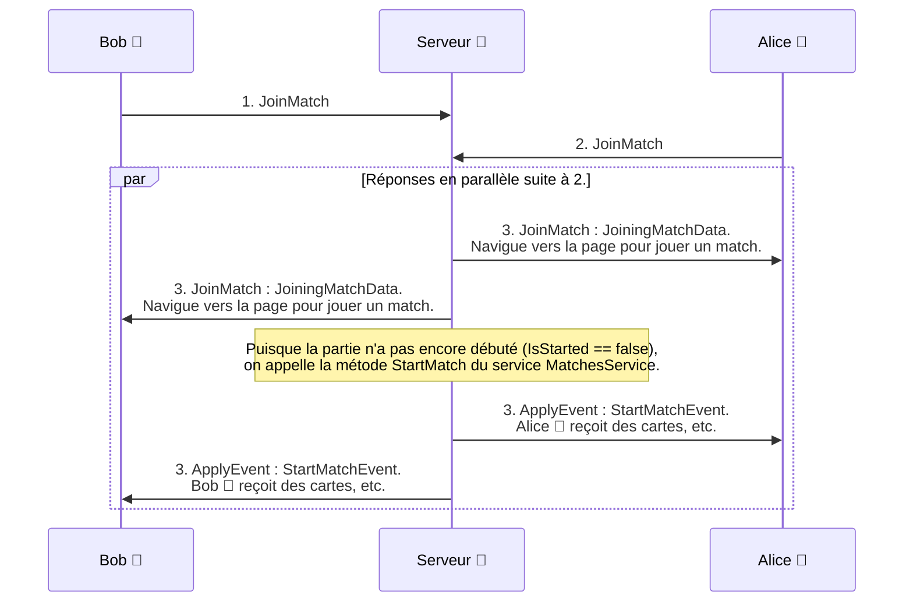
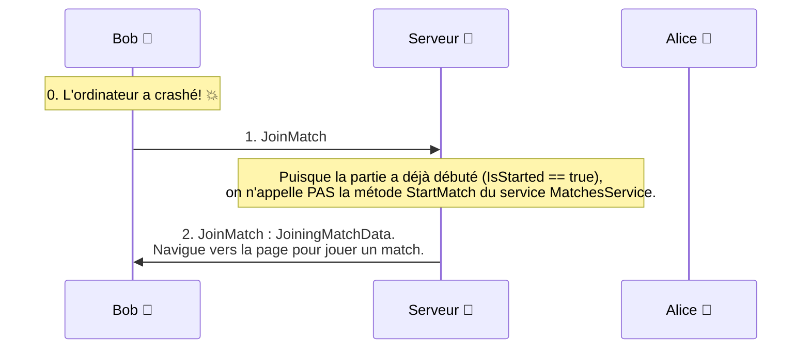
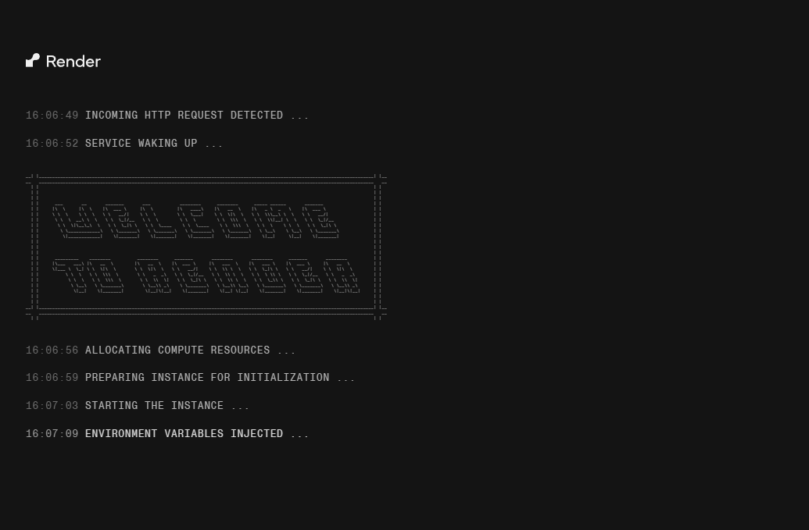

import Tabs from '@theme/Tabs';
import TabItem from '@theme/TabItem';

# TP1 (Super Cartes Infinies)

## Le projet

Développer un jeu de cartes (avec un style similaire à Hearthstone).
Le projet se fait en équipe de 3 ou 4.

<!-- 🚧 Les détails du TP1 seront dévoilés plus tard -->

## Évaluations

- Diagramme de classes (Remise à la **Rencontre 7**)
- Évaluation **individuelle** (Évaluation à la **Rencontre 10**, sauf tâche **Hub** à la **Rencontre 11**)
- Évaluation de **groupe** (Évaluation à la **Rencontre 13**)

## L'application

### Objectifs :

- Analyser un problème et le découper en Epics, User Stories et Tasks à l'aide d'Azure DevOps Boards.
- Créer un diagramme de classes de la solution.
- Compléter un application web à l’aide d’Angular, Web API et MVC pour faire un jeu de cartes de style HearthStone.
- Le site Angular sera utilisé par des membres inscrits en utilisant des tokens pour l'authentification.
- L’administrateur pourra configurer le contenu de l’application à l’aide de MVC.
- Il n'est pas nécessaire d'écrire des tests pour le premier TP, mais nous allons en écrire pour les 2 prochains.

### Les règles :

- Deux joueurs s’affrontent avec leurs cartes.
- Chaque joueur pige un nombre de cartes configurable dès le départ.
- Chaque joueur pige une carte au début de son tour.
- Chaque joueur reçoit une quantité configurable de mana au début de son tour.
- Chaque carte a une certaine quantité de points d’attaque, une certaine quantité de points de défense et un coût en mana.
- Les joueurs ne pourront **pas encore jouer de carte** avant le TP2. Nous allons voir les règles du jeu plus en détail à ce moment.
- Un joueur peut terminer son tour. Le tour de l’autre joueur commence alors et il reçoit sa carte et son mana.
- Un joueur peut abandonner la partie et il perd alors automatiquement (l’autre joueur a une victoire).

### Clarification :

Le mot « carte » est utilisé très fréquemment, mais il faut comprendre que l’on ne parle pas toujours du modèle de donnée (Card). En effet, lorsqu’on configure le jeu, le mot carte fait référence au « modèle » de la carte. Mais si on mentionne qu’un joueur possède des cartes, on a besoin d’un modèle qui permet d’associer une carte à un joueur. Le premier livrable du projet est un diagramme de classe qui va permettre de clarifier tout ça.

### Contraintes

- Le travail doit être effectué en équipes de 3 ou 4.
- Vous devrez utiliser Git/GitHub.
- Vous devrez utiliser Azure DevOps pour la gestion des tâches.
- Vous devrez compléter une application cliente en Angular.
- Vous devrez compléter une application serveur en ASP.NET MVC et WebAPI.

## Livraisons du TP

### Matériel de départ

Voici le diagramme de classe à compléter. Vous devrez compléter le diagramme dans le `README.md` du repo de votre projet .NET. Vous pouvez consulter la documentation de Mermaid si vous le désirez : [Diagrammes Mermaid](https://mermaid.js.org/syntax/classDiagram.html).

<!-- Attention, si on modifie le diagramme ici, il faut aussi le modifier sur le projet de départ .NET  -->


Pour le client et le serveur:

- Votre enseignant aura créé les repos nécessaires au projet à l'aide de Github Classroom.
  - Assurez vous que chaque membre de l'équipe y a accès.

<!-- C'est maintenant déjà fourni avec Github Classroom
- Ajouter ensuite téléchargez un zip de chacun de ces projets, ajouter le contenu des zips extraits à chacuns des repos respectifs, et faire un commit/push. Voici les repos de départ:
  - 🔗[Client de départ](https://github.com/CEM-420-5W5/ngsci-depart)
  - 🔗[Serveur de départ](https://github.com/CEM-420-5W5/sci-depart)
-->

- Créer les branches suivantes
  - Serveur:
    - MVC
    - Authentification
    - SignalR
  - Client:
    - Angular
    - Authentification
    - SignalR

:::info
Chaque étudiant doit travailler dans la **bonne branche pour son travail**. Une fois que les parties individuelles seront terminées, vous allez pouvoir tout ramener vers la même branche. Nous allons voir comment bien le faire en classe!
:::

### Les étapes

Il y a 3 étapes de livraison du premier TP :

- Diagramme de classe et Azure DevOps (évaluation de groupe)
- Fonctionnalités (évaluation individuelle)
- Intégration des fonctionnalités, DevOps et Git (évaluation de groupe)

## Le détail des tâches individuelles

<details>
<summary>Section d’administration (MVC)</summary>
- L’administrateur peut créer, modifier, voir et supprimer les **cartes modèles** (CRUD).
- Cartes de départ:
  - Mettre en place le modèle de données des cartes de départ.
  - L’administrateur peut modifier les cartes de départ des nouveaux joueurs. **Faire un tri par le nom de la carte dans l’Index.**
  - Ajouter un seed des cartes de départ. Il doit contenir 3 cartes différentes avec une seule copie et 3 autres cartes avec deux copies chaque.
  - Il existe un **STUB** de StartingCardsService pour les cartes de départ. Il faut retourner les cartes configurées à l'aide des cartes de départ.
- Configuration:

  - Mettre en place le modèle de données de la configuration (**GameConfig**).
  - Ajouter une page de configuration pour l’administrateur. Permettre d’avoir une configuration pour le **nombre de cartes à piger** avant de commencer la partie (nbCardsToDraw) et la **quantité de Mana reçu au début de chaque tour**.
  - Ajouter un seed pour la configuration avec une quantité de 4 cartes à piger et 3 manas par tour.

  :::warning
  Ce n’est pas un problème que la configuration soit une table avec une seule entrée. Dans une version plus avancée du projet, on pourrait imaginer qu’il y ait plusieurs modes de jeu différents avec des configurations différentes. Vous pouvez faire simplement utiliser First() sur le DbSet.
  :::

  - Il existe un **STUB** du MatchConfigurationService qui retourne le nombre de cartes reçu au début de la partie et le nombre de mana reçu par tour. Il faut retourner les valeurs de la configuration.

- Ajoutez un lien sur la page home vers les pages suivantes: "Cartes", "Cartes de départ" et "Configuration"
- Protégez TOUT les contrôleurs (sauf Home) pour que le rôle admin soit nécessaire.
- Vous pouvez simplement retirer les pages détails de vos contrôleurs/vues

:::warning
Le site doit être développé en **français**, **MAIS** ce n'est **pas** nécessaire de traduire tout ce qui est relié à l'authentification avec **Identity**. Donc simplement utiliser le français pour le contenu que vous ajoutez (Ce qui inclus d'utiliser des DisplayName pour afficher les mots en français).
:::

</details>

<details>
<summary>Enregistrement et connexion (Authentification)</summary>

.NET:

- Mettre en place le modèle de données **OwnedCard** pour permettre aux players d'avoir ses propres cartes.
- Ajouter un contrôleur d'API pour gérer l'enregistrement et la connexion.
- Lors de l'enregistrement, il faut appeler la méthode CreatePlayer de PlayersService.
- Il faut terminer l'implémentation de la méthode CreatePlayer de PlayersService.
- Il existe un **STUB** du CardsService qui retourne les cartes d'un joueur avec GetPlayersCards. Il faut retourner les cartes du joueur (OwnedCards).

Angular:

- Register:
  - ReactiveForms valide que le courriel a le bon format, le mot de passe de confirmation est identique et que les champs sont tous requis.
  - Affichage des messages d’erreurs si le format du mot de passe n’est pas valide ou si l’utilisateur existe déjà.
  - Faites la validation de la longueur du mot de passe en utilisant Reactive Forms. Vous pouvez également valider les autres critères comme l’utilisation de caractères spéciaux, mais c’est optionnel.
- Login Reactive forms:
  - Validation des deux champs requis.
  - Affichage des messages d’erreurs provenant du serveur.
- Un register doit AUTOMATIQUEMENT faire un login de l'utilisateur. Donc l'utilisateur n'a pas à faire un login après son register.
- Rester connecté en utilisant le **sessionStorage** pour conserver le token, le PLAYER id et le nom du player
- Afficher le nom de l’utilisateur dans le haut de la page, tant que l'utilisateur ne se déconnecte pas.
- Implémenter la déconnexion côté client
- ATTENTION: Ajouter un bouton de test sur la page principal et faire un appel à une méthode avec [Authorize] qui retourne une **liste** de strings. Simplement pour vérifier que vos tokens fonctionnent bien. Affichez le résultat de l'appel avec un snackbar.

```csharp
[Authorize]
[HttpGet]
public ActionResult<string[]> PrivateData()
{
    return new string[] { "figue", "banane", "noix" };
}
```

</details>

<details>
<summary>Angular</summary>

- Afficher les cartes existantes avec Angular (Page Magasin) [Pas encore possible d’acheter ou de vendre des cartes]
- Afficher les cartes du joueur avec Angular (Page Mes Cartes).
- Pour les deux pages de cartes (Page Magasin et page Mes Cartes), ajouter une option de tri selon les trois champs suivants: "Attack", "Health" et "ManaCost".
  - L'utilisateur doit voir les options en **français**.
  - Il faut également permettre de faire le tri par ordre **croissant** ou **décroissant**.
  - Il faut créer un component pour faire le tri et afficher les cartes et le réutiliser dans les deux pages. (Il y a donc 1 component par page + 1 component réutilisé pour un total de 3)

||
|-|


- Afficher un dialogue qui montre que l’on recherche un adversaire. Après 5 secondes, lancer le match de test comme avant.
- Ajouter la logique pour GainManaEvent dans applyEvent de MatchService. (Vous allez maintenant voir le mana qui monte au début du tour)
- Ajouter un dialogue de défaite et de victoire lorsqu’on a une fin de partie. Il existe déjà:
  - Une class css .end pour vous aider.
  - Les méthodes **endMatch** et **isVictory**.

</details>

<details>
<summary>Hub (SignalR)</summary>

- Ajouter les events `DrawCardEvent` et `GainManaEvent` dans `PlayerStartTurnEvent` en passant la quantité de Mana à partir du `MatchesService`.
- Ajouter les events `DrawCardEvent` dans `StartMatchEvent` en passant le nombre de cartes à partir du `MatchesServices`.
- Pour faire fonctionner **SignalR**, vous allez devoir modifiez vos **CORS** dans **Program.cs**. Il faut simplement ajouter:

```csharp
policy.AllowCredentials();
```

- Ajouter la logique pour supporter la connection, `JoinMatch`, `EndTurn` et `Surrender`.
- Utiliser le hub du côté Angular. Regarder le code dans:
  - `home.component.ts` (Pour créer la connection et joindre un match)
  - `match.component.ts` (Pour gérer le `EndTurn`, le `Surrender` et les `MatchEvent`)
- Créer un service Angular pour votre Hub, c'est plus propre et ça va permettre d'utiliser dans MatchComponent, la connection créée dans le `HomeComponent`.
- Dans `match.component.ts`, c'est **possible** d'établir une connection s'il n'y en a pas déjà une. C'est le cas si on fait un refresh sur cette page. Mais ce n'est pas obligatoire pour le TP1. Vous pouvez vous créer un genre de singleton qui s'assure que la connexion existe avant qu'elle puisse être utilisée. Par exemple :

```text
hubConnection?: signalR.HubConnection;

obtenirLaConnexion() retourne signalR.HubConnection
    si la connexion n'existe pas
        créer la connexion

    retourner la connexion
```

:::warning

- L’affichage du Mana ne devrait pas encore fonctionner, mais tout devrait s’arranger une fois que l’on va faire l’intégration.
  :::

#### Logique pour joindre un match

Prenez le temps de regarder le code pour comprendre comment les méthodes `JoinMatch` et `StartMatch` du service `MatchesService` fonctionnent. Voici un résumé de la logique pour joindre un nouveau match:

<Tabs>
  <TabItem value="description" label="Description" default>

1. Bob 👨 veut jouer et un appel à l'action `JoinMatch` du Hub est fait. `JoinMatch` retourne null (n'envoie rien à Bob 👨), mais Bob 👨 est maintenant en attente d'un partenaire. (Le serveur se souvient de Bob 👨)
2. Alice 👩 veut jouer et un appel à l'action `JoinMatch` du Hub est fait.
3. `JoinMatch` envoie un `JoiningMatchData` à Alice 👩 dont la propriété `OtherPlayerConnectionId` est celle de la connection de Bob 👨 et `IsStarted` est `false`
4. On envoit un message aux deux joueurs avec le `JoiningMatchData` (Si vous regardez le client, il y a un objet similaire qui se nomme `MatchData` qui est utilisé dans `MatchService`)
5. On appel également la méthode `StartMatch` du service `MatchesService` car c'est un nouveau match et on envoit ensuite un message aux 2 joueurs pour traiter le `StartMatchEvent`.

  </TabItem>
  <TabItem value="diagramme" label="Diagramme">



  </TabItem>
</Tabs>

Note: Vous avez donc besoin de définir un message qui permet d'envoyer le `JoiningMatchData` pour faire le `playMatch` sur le client ET un message pour envoyer un `StartMatchEvent` et faire un `applyEvents` sur le client.

Si on veut rejoindre un match qui était déjà commencé et pas terminé. Par exemple, si je ferme ma fenêtre et j'en ouvre une nouvelle et je fais "joindre une partie", je veux retourner dans la même partie dans laquelle j'étais.

<Tabs>
  <TabItem value="description" label="Description" default>

0. Bob 👨 et Alice 👩 étaient dans un match, mais le navigateur de Bob 👨 a crashé. 💥
1. Bob 👨 veut retourner sur sa partie. Un appel à `JoinMatch` est fait.
2. On envoit un message à Bob 👨 avec le `JoiningMatchData` (L'autre joueur a probablement encore sa fenêtre ouverte, on a pas besoin de rien lui envoyer!)

  </TabItem>
  <TabItem value="diagramme" label="Diagramme">



  </TabItem>
</Tabs>

#### Players et Users de test

Comme le register/login, n'est pas encore implémenté, il faut faire de petits ajustements pour pouvoir travailler:

- Vous allez voir qu'il existe 2 users et 2 players dans le seed pour vous permettre de tester le Hub avec les ids: "User1Id" et "User2Id"
- Il va vous falloir passer le user Id à vos actions de Hub car on ne peut pas utilier de `[Authorize]`, ni accéder à l'utilisateur connecté.
  - Faites une méthode séparée pour le JoinMatch, ne le faites pas automatiquement dans la connexion, sinon vous ne pouvez pas passer le user Id.
- Il faut modifier le client pour avoir l'option de se connecter avec un User 1 ou 2. Vous pouvez simplement ajouter un deuxième bouton et modifier le joinMatch de HomeComponent: (Le playerId dans le sessionStorage va être utile au moment d'utiliser MatchService)

```ts
joinMatch(user1:boolean) {
    // TODO: Angular: Afficher un dialogue qui montre que l'on attend de joindre un match
    // TODO: Hub: Se connecter au Hub et joindre un match
    let userId:string = user1 ? "User1Id" : "User2Id";
    if(user1)
      sessionStorage.setItem("playerId", "1");
    else
      sessionStorage.setItem("playerId", "2");
```

</details>

## Intégration (à faire seulement une fois que les fonctionnalités individuelles sont terminées pour préparer à l’évaluation de groupe)

- Ramenez les différentes branches vers la branche Dev.
- Assurez-vous de vous connecter à un vrai match avec le Hub.
- Assurez-vous d’utiliser la bonne implémentation de MatchConfigurationService.
- Assurez-vous d’utiliser la bonne implémentation de MatchService côté Angular.
- Assurez-vous d’utiliser la bonne implémentation de StartingCardsService.
- Assurez-vous d’utiliser la bonne implémentation pour le WebAPI pour obtenir les cartes du joueur.
- Dans MatchPlayerData, utiliser les cartes du joueur.
- Utilisez un guard pour limiter l'accès à la page Mes Cartes et Match à un utilisateur connecté.
- Assurez-vous de vous déconnecter du Hub si vous faites cancel et de ne plus attendre pour un Match.
- Assurez-vous de bien setter le playerId dans le sessionStorage lors de votre connexion.
- Utilisez \[Authorize\] dans le **Hub** pour s'assurer que l'utilisateur est bien connecté et arrêter de passer le userId dans les appels et obtenez-le directement dans le Hub.
- Ajoutez le code nécessaire pour faire fonctionner le \[Authorize\] avec SignalR et les tokens (Voir [SignalR #2](/exercices/SignalR2))

## Grille de correction

- 12% de la note pour l’évaluation individuelle (voir le document sur la correction individuelle)
  - 2% pour l'utilisation d'Azure DevOps Boards
  - 10% pour le code et les fonctionnalités
- 8% de la note pour l’évaluation de groupe
  - 3% pour le diagramme de classe
  - 5% pour l'intégration des fonctionnalités du projet et les dernières fonctionnalités

## Référence pour la remise finale en équipe

Une référence pour voir un client et un serveur fonctionnels.

- 🔗[Client Angular](https://ngsci.onrender.com/)

:::info
Username: admin@admin.com Le mot de passe: Passw0rd!
:::

- 🔗[Serveur MVC](https://sci-mvc.onrender.com/)

:::warning
Si vous voyez la page suivante, il faut simplement attendre que l'application démarre
:::

<details>
<summary>Il faut parfois attendre avant de pouvoir accéder à la démo...</summary>

</details>

<!-- Avec supabase, ce n'est plus un problème!

:::danger Attention!
La démonstration de la partie MVC et de la partie Angular ne partagent pas la même base de donnée, comme ce devrait être le cas. Les StartingCards choisies dans l'interface administrateur n'auront donc aucune incidence sur la partie Angular, **dans la démonstration**. **Dans votre partie à vous**, les StartingCards choisies dans l'interface administrateur doivent se refléter dans la partie Angular, lors de la création de compte.
:::

-->
