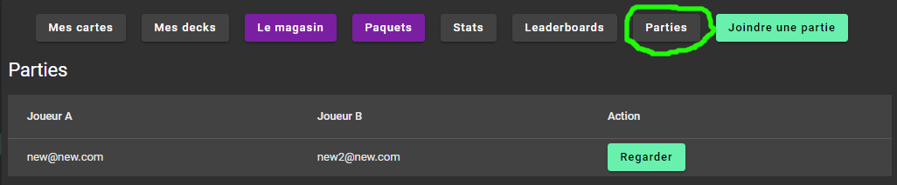

# TP2 (Suite de Super Cartes Infinies)

## Le projet
Ajouter des fonctionnalités au jeu de cartes développé lors du Sprint 1.

:::info
Vous devez choisir une des tâches suivantes qui sera évaluer de façon individuelle. Vous devez écrire vous-même le code, mais vous pouvez collaborer avec vos collègues.
:::

### Les tâches individuelles
- **\[Obligatoire\]** Ajout des pouvoirs (Powers)
- **\[Obligatoire\]** Logique de jeu
- **\[Obligatoire\]** Ajout des decks
- Rareté et achat de paquets de cartes

### Contraintes
- Le travail doit être effectué en équipes de 3 ou 4.
- Vous devez utiliser **Git/GitHub**.
- Vous devez utiliser **DevOps** pour la gestion des tâches ET utiliser les **sprints**.

### Les étapes et évaluations
Il y a 2 évaluations, mais il est fortement recommandé de terminer les tâches individuelles au moins une semaine avant la remise d'équipe :
- Premier livrable d'équipe (Première évaluation)
- Fonctionnalités individuelles
- Merge et dernière fonctionnalité (Deuxième évaluation)

## Premier livrable d'équipe
- Diagramme de classes
- Planification du travail dans Azure DevOps 
- Changements au modèle de données (pour satisfaire à toutes les tâches individuelles de votre équipe)
- Ajout des classes suivantes (entre autres) pour faire l'ajout de powers aux cartes et la logique de jeu

La classe **Power**
```csharp
public class Power
{
    public const int FIRST_STRIKE_ID = 1;
    public const int THORNS_ID = 2;
    public const int HEAL_ID = 3;

    public int Id { get; set; }

    // TODO: À compléter
}
```

La classe **CardPower**
```csharp
public class CardPower
{
    public int Id { get; set; }
    public virtual Card Card { get; set; }
    public virtual Power Power { get; set; }
    public int Value { get; set; }
}
```

Ajouter de cette méthode à la classe **Card**
```csharp
[ValidateNever]
public virtual List<CardPower> CardPowers { get; set; }
```

Ajouter les méthodes suivantes à la classe PlayableCard (Voir le code fournit dans la section "Logique de jeu")
```csharp
public bool HasPower(int powerId)
{
    // Return true if the Card has that power
}
public int GetPowerValue(int powerId)
{
    // Return the value of that power for that card. 
    // Simply returns 0 if the card doesn't have the power.
}
```
- Ajouter des tests unitaires pour vérifier que ces nouvelle méthodes fonctionnent correctement
    - Un test qui vérifie que HasPower retourne false si un **AUTRE power** est présent sur la carte
    - Un test qui vérifie que GetPowerValue retourne 0 si un **AUTRE power** est présent sur la carte
    - Un test qui vérifie que HasPower retourne true si power avec le même Id est présent sur la carte
    - Un test qui vérifie que GetPowerValue retourne la bonne valeur si un power avec le bon Id et une valeur est présent sur la carte

## Tâches individuelles
<details>
    <summary>Ajout des pouvoirs (Powers)</summary>
    - Les cartes peuvent avoir un certains nombres de pouvoirs.
    - Un pouvoir a un nom, une description et un icône.
    - Quand une carte possède un pouvoir, il peut y avoir une valeur entière en plus de la relation (Voir les pouvoirs dans les [règles de jeu](#les-règles-de-jeu))
    - Utiliser les Ids de pouvoirs de la classe Power dans votre seed et dans vos MatchEvents
    - Pouvoir associer les pouvoirs aux cartes dans le menu **Edit** (MVC)
        - Voir la liste des pouvoirs d'une carte et pouvoir les retirer un à un
        - Pouvoir ajouter un nouveau pouvoir avec une valeur entière
    - Voir les pouvoirs avec leur valeur sur les cartes sur le client, dans tous les endroits (Mes cartes, magasin, pendant une partie, etc)
    - Ajouter les pouvoirs dans le seed
    - Animer les pouvoirs en cliquant sur une carte dans Mes Cartes (Afficher l'icône du pouvoir sur la carte pendant 2 secondes)
        - Afficher les pouvoirs un après l'autre si il y en a plusieurs
        - Note: On fait ça pour tester les animations et être prêt à les afficher pendant un match
</details>

<details>
    <summary>Logique de jeu</summary>
    - Faire passer les tests de TDD (Voir les [règles de jeu](#les-règles-de-jeu))
    - Pour que les [tests fournis](https://cegepedouardmontpetit.sharepoint.com/:u:/s/CMT420InformatiqueComitesCours-5W5/Ee-3J4x8mxVAl_6JoRJUSDEBV-1q8yiwBC_aaGIDaNwX9Q?e=40i7sT) compilent, il faut avoir déjà ajouté les classes nécessaires et la classe suivante:

L'event **PlayCardEvent**
```csharp
public class PlayCardEvent : MatchEvent
{
    // TODO: Ajouter tout ce qui manque
    public PlayCardEvent(MatchPlayerData currentPlayerData, MatchPlayerData opposingPlayerData, int playableCardId)
    {
    }
}
```
    - Il faut écrire des tests pour le pouvoir au choix et ils doivent également passer avec succès
    - IMPORTANT: En écrivant la logique de jeu, il faut utiliser des MatchEvents. Ces MatchsEvents vont être utilisé pour rejouer les changements sur le client.
    - Il faut donc au moint un MatchEvent pour **chaque pouvoir**, mais également un lorsqu'une carte **attaque, reçoit des dégâts ou meurt**.
    - Conseil: Ajoutez également un **CardActivationEvent**, ce sera un bon endroit pour gérer le combat et vérifier les pouvoirs d'une carte et les déclencher
    - Conseil: Utilisez les méthodes **HasPower** et **GetPowerValue** que vous avez ajouté à PlayableCard pour écrire la logique de jeu.
:::warning
    La gestion des événements sur le client est la responsabilité de toute l'équipe une fois que les parties individuelles ont été regroupées
:::
    - Le diagramme suivant donne une façon de faire pour gérer les events lors d'un combat. Le CardActivationEvent est un bon event pour inclure la logique de plusieurs pouvoirs, comme Heal.

    ||
    |-|


</details>

<details>
    <summary>Ajout des decks</summary>
    - Un deck a un nom en plus de contenir des cartes (les cartes qu'un joueur possède)
    - Seul les cartes du Deck courant sont disponibles lors d’une partie. (Ce sont les cartes qui vont remplir le CardsPile du match pour ce joueur)
        - Changer le démarrage d'un Match pour utiliser les cartes du deck courrant
    - Lors du register, un deck qui se nomme "Depart" est créé automatiquement avec toutes les cartes du joueur. (C'est le deck courant du joueur)
    - Une même carte peut faire partie de plusieurs decks. (Les decks sont indépendants les uns des autres)
    - Si j'ai une copie (1 entrée OwnedCard) pour une carte, je peux la mettre au maximum une fois dans un deck. Si j'en ai N, je peux en ajouter N.
        - Donc quand j'ajoute une carte à un deck, je dois proposer à l'usager **SES** cartes qui ne sont **PAS** déjà dans **CE** deck.
    - Configuration MVC:
        - Nombre max de decks
        - Nombre max de cartes dans un deck
    - Client:
        - Afficher la liste des decks d'un joueur dans une section "Mes Decks"
        - Pouvoir créer un nouveau deck avec un nom au choix (en respectant la limite de decks de la configuration)
        - Pouvoir effacer un deck, si ce n'est pas le deck courant (On ne perd jamais de cartes!)
        - Pouvoir ajouter et retirer une carte à un deck existant (en respectant la limite de carte de la configuration)
            - Assurez-vous de trier les cartes du joueur pour faciliter la sélection
        - Pouvoir rendre un deck courant
        - Doit etre impossible d'effacer le deck courant (vérification serveur)
    - Ajouter des tests unitaires pour les nouveaux services
</details>

<details>
    <summary>Achat de paquets de cartes (Pour les équipes de 4)</summary>
    
    **Résumé:** Les joueurs peuvent acheter des paquets de cartes (Pack) avec une monnaie virtuelle dans le jeu.
    - Ajouter une rareté aux cartes. Il doit y avoir 4 niveaux: (Utilisé un enum)
        - Commune (Gris)
        - Rare (Vert)
        - Épique (Mauve)
        - Légendaire (Orange)
    - Ajouter la possibilité de voir et changer la rareté d’une carte en MVC.
    - Modifier le seed des cartes avec au moins 2 cartes pour chaque rareté.
    - Sur le client, il faut afficher un code de couleur sur les cartes pour pouvoir voir leur rareté. Une option simple c’est de modifier la couleur de fond du titre.
    - Tâche MVC de configuration de la monnaie virtuelle:
        - Reçue à la création du compte
        - Reçue après une victoire
        - Reçue après une défaite (plus petit montant)
    - Sur le client
        - Afficher la monnaie virtuelle du joueur dans la barre de menu au haut de l'écran.
        - Afficher la monnaie gagné dans le menu de victoire/défaite.
        - Afficher les différents paquets que le joueur peut acheter. 
        - Afficher l'ouverture de paquet sur le client avec un dialogue (qui affiche les cartes reçues)
    - Voir la [section sur les paquets de cartes](#détails-sur-les-paquets-de-cartes)
    - Ajouter des tests unitaires pour les nouveaux services
</details>

## Merge et dernière étape
<details>
    <summary>Travail d'équipe</summary>
    - Compléter les tâches individuelles au moins une semaine avant la remise
    - Faire les merge vers votre branche commune

:::warning
    N'oubliez pas de commencer par faire un merge de la branche commune vers votre branche individuelle pour régler les conflits!
:::

    - Ajoutez la gestion des évènements sur le client dans MatchService.
        - Il faut déplacer les cartes vers le BattleField lorsqu'elles sont jouées
        - Les déplacer vers le Graveyard lorsqu'elles meurent
        - Faire bouger une carte lorsqu'elle est activée (faire un mouvement qui montre qu'elle est activée)
        - Afficher l'icône des pouvoirs sur la carte lorsqu'ils sont activés (pour environ 1 seconde)
        - Mettre à jour le health des cartes lorsqu'il change
        - Mettre à jour le health des joueurs lorsqu'il change
</details>

## Détails
### Les règles de jeu
<details>
    <summary>Détails des règles de jeu</summary>
    - Mélanger les cartes dans le CardsPile avant de démarrer une partie pour ne pas toujours commencer avec les mêmes cartes.
    - On peut jouer plusieurs cartes par tour, selon leur coût en « Mana ».
        - Chaque carte à un coût en Mana différent.
        - Pendant son tour, un joueur peut jouer une carte si il a assez de mana. On réduit ensuite son mana du coût de la carte.
        - Lorsque le Mana n’est pas utilisé, il est conservé pour le tour d’après.
        - Lorsqu'un joueur clique sur terminer, les cartes qui sont déjà en jeu doivent être "activé" une après l'autre pour faire un combat.
    - Lorsqu'une carte est joué, elle se place à la droite des cartes déjà en jeu.
    - Chaque carte a donc son "index", celle qui est le plus à gauche à l'index 0, la 2e l'index 1, etc.
    - Lorsqu'une carte est activé et qu'il y a une carte devant elle (l'adversaire a une carte avec le même index), les deux cartes se donnent des dégâts.
        - Chaque carte perd du health égal à l'attaque de la carte en face d'elle
    - Lorsqu'une carte est activé et qu'il n'y a pas de carte devant elle, elle blesse l'adversaire. Le Player adverse perd du health de la valeur de l'attaque.
    - Les pouvoirs des cartes affectent les combats
    - Lorsque les cartes sont activées, il faut commencer par la dernière qui a été joué et terminer avec celle qui est en jeu depuis le plus longtemps. On active donc les cartes de droite à gauche. Ce qui veut également dire que l'on commence par la carte avec l'index le plus élevé et que l'on termine avec l'index 0.

:::waring
Pour l'activation des cartes, c'est plus facile d'utiliser une boucle **for**. Comme c'est possible qu'une carte meurt, la liste de cartes du BattleField risque d'être modifié et on ne peut pas modifier la liste pendant une itération avec un **foreach**.
:::
</details>

### Pouvoirs
<details>
    <summary>Les pouvoirs</summary>
    - Il y a 3 pouvoirs (Power) que vous devez ajouter et vous devez en **ajouter 1 autre à votre choix**.
        - **First Strike** permet à une carte d’attaquer en « premier » et de ne pas recevoir de dégât **si elle tue la carte** de l’adversaire. (Fonctionne uniquement à l’attaque, pas à la défense)
        - **Thorns X** lorsqu’une carte défend, elle inflige X de dégâts AVANT de recevoir des dégâts. Si l’attaquant est tué par ces dégâts, l’attaque s’arrête et le défenseur ne reçoit pas de dégâts.
        - **Heal X** soigne les cartes alliées de X incluant elle-même AVANT d’attaquer (mais les cartes ne peuvent pas avoir plus de health qu’au départ.) 
    
 :::warning
    - Pour l’instant, les pouvoirs proposés ne nécessitent pas de garder un « état » et c’est conseillé de **choisir un pouvoir sans état pour le TP2**. Un exemple de pouvoir avec état, c’est « Stun » qui ajoute l'état « Stunned » à une carte. Nous allons ajouter des pouvoir avec état au TP3.
:::
</details>

### Détails sur les paquets de cartes
- Ajouter 3 paquets de cartes que les joueurs peuvent acheter. Les cartes sont obtenues au hasard, mais en suivant les règles suivantes.

| Type | Rareté par défaut | Nb Cartes | Règles d’obtention des cartes (sinon c’est la rareté par défaut)
| :--- | :----: | :----: | :----: |
| Basic | Commune | 3 | 30% de rare
| Normal | Commune | 4 | 1 carte rare. Pour le reste : 30% rare, 10% épique, 2% légendaire
| Super	| Rare	| 5	| 1 carte épique. Pour le reste 25% épique, 10% légendaire. (Aucune commune)

- Les paquets ont un nom, une url d’image et un prix.
- La configuration des paquets et des probabilités est faite dans un seed, ce n’est pas nécessaire de pouvoir les modifier en MVC.
- Voir le pseudo code suivant pour vous aider avec la logique d'obtention des cartes

<details>
<summary>Pseudo code pour la rareté des cartes d'un paquet</summary>
```
// Une Probability possède : une value décimale (entre 0 et 1), une "rarity" et un "baseQty"
 
// Faire une liste de rareté de carte à obtenir
List<Rarity> GenerateRarities(int nbCards, int defaultRarity, List<Probability> probabilities)
    rarities = new List<Rarity>
 
    // Ajouter la quantité de base pour chaque probability à la liste
    foreach(probability of probabilities)
        for probability.baseQty
            add probability.rarity to rarities
 
    // Continuer de remplir la liste jusqu'à atteindre la quantité voulue
    while(rarities.Count < nbCards)
        rarity = GetRandomRarity(probabilites)
 
        if(rarity == null)
            add defaultRarity to rarities
        else
            add rarity to rarities
 
    return rarities

 
// Cette méthode permet d'obtenir une rareté au hasard
Rarity? GetRandomRarity(List<Probability> probabilities)
    X = Random Number Between 0 and 1
 
    for each rarity of probabilities:
        if probability.value < X:
            return probability.rarity
        else:
            X -= probability.value
 
    return null
```
Une fois que l’on a une liste de rareté, on peut prendre une carte au hasard avec chacune des raretés pour faire notre paquet. Les doublons sont permis. 
</details>

## Grille de correction
- 12% de la note pour l’évaluation individuelle (voir le document sur la correction individuelle)
- 8% de la note pour l’évaluation de groupe
    -	4% pour la première remise
    -	4% pour la remise final


## Référence pour la remise finale en équipe

Une référence pour voir un client et un serveur fonctionnels.

- 🔗[Client](https://wonderful-coast-01064ff10.5.azurestaticapps.net/)

:::info
Vous pouvez simplement utiliser register pour ajouter vos propres joueurs
:::

- 🔗[Serveur](https://supercartesinfiniesTP2.azurewebsites.net/)

:::info
Username: admin@admin.com Le mot de passe: Passw0rd!
:::

:::danger
C'est possible que les exemples ne fonctionnent pas bien selon vos options de cookies. Nous allons les regarder en classe. Pour le truc: [Cookies](/info/Trucs#pour-accepter-les-cookies-third-parties)
:::
