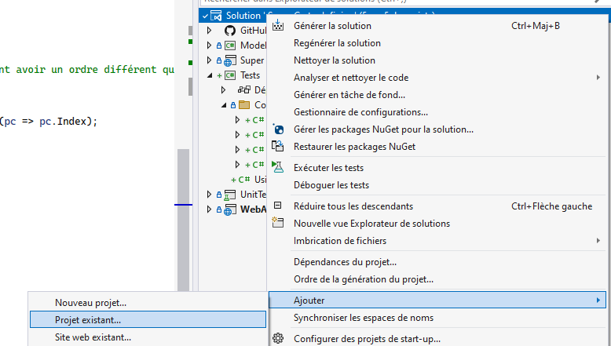

import Tabs from '@theme/Tabs';
import TabItem from '@theme/TabItem';

# TP2 (Suite de Super Cartes Infinies)

## Le projet

Ajouter des fonctionnalités au jeu de cartes développé lors du Sprint 1.

:::info
Vous devez choisir une des tâches suivantes qui sera évaluée de façon individuelle. Vous devez écrire vous-même le code, mais vous pouvez collaborer avec vos collègues.
:::

:::warning
Si vous avez choisi la tâche MVC pour le TP1, vous ne pouvez pas choisir la tâche MVC pour le TP2.
:::

### Les tâches individuelles

- **\[Obligatoire\]** MVC - Ajout des pouvoirs (Powers)
- **\[Obligatoire\]** Logique de jeu
- **\[Obligatoire\]** Ajout des decks
- Rareté et achat de paquets de cartes

### Contraintes

- Le travail doit être effectué en équipes de 3 ou 4.
- Vous devez utiliser **Git/GitHub**.
- Vous devez utiliser **DevOps** pour la gestion des tâches ET utiliser les **sprints**.

### Les étapes et évaluations

Il y a 2 évaluations, mais il est fortement recommandé de terminer les tâches individuelles au moins une semaine avant la remise d'équipe :

- Premier livrable d'équipe (Première évaluation)
- Fonctionnalités individuelles
- Merge et dernière fonctionnalité (Deuxième évaluation)

## Premier livrable d'équipe

- Diagramme de classes
- Planification du travail dans Azure DevOps
- Changements au modèle de données (pour satisfaire à toutes les tâches individuelles de votre équipe)
- Ajout des classes suivantes (entre autres) pour faire l'ajout de powers aux cartes et la logique de jeu

La classe `Power`

```csharp
public class Power
{
    public const int FIRST_STRIKE_ID = 1;
    public const int THORNS_ID = 2;
    public const int HEAL_ID = 3;

    public int Id { get; set; }

    // TODO: À compléter
}
```

La classe **CardPower**

```csharp
public class CardPower
{
    public int Id { get; set; }
    public int CardId { get; set; }
    public virtual Card Card { get; set; }
    public int PowerId { get; set; }
    public virtual Power Power { get; set; }
    public int Value { get; set; }
}
```

Ajouter de cette méthode à la classe `Card`

```csharp
[ValidateNever]
public virtual List<CardPower> CardPowers { get; set; }
```

Ajouter les méthodes suivantes à la classe `PlayableCard` (Voir le code fournit dans la section "Logique de jeu")

```csharp
public bool HasPower(int powerId)
{
    // Retourne true si la carte possède ce pouvoir.
}
public int GetPowerValue(int powerId)
{
    // Retourne les valeur du pouvoir pour cette carte.
    // Simplement retourner 0 si la carte ne possède pas ce pouvoir.
}
```

### Ajout du projet de tests unitaire TDD (Test Driven Development)

- Pour que les [tests fournis](https://cegepedouardmontpetit.sharepoint.com/:u:/s/CMT420InformatiqueComitesCours-5W5/ETZ9RkBd_XxLulRU65bykOgBoy1J2h18KbqpFUgoup1J2w?e=IKFuWa) compilent, il faut avoir déjà ajouté les classes nécessaires qui sont mentionnées plus haut.
- Il faut extraire le contenu du fichier .zip dans votre solution et ensuite ajouter le projet à votre solution:

<details>
    <summary>Détails</summary>

    

</details>

:::warning
Ces tests ne vont pas passer pour l'instant (C'est le travail d'un membre de votre équipe pour ce TP), **mais ils devraient au moins compiler.**
:::

### Ajouter vos propres tests

- Ajouter des tests unitaires pour vérifier que ces nouvelles méthodes fonctionnent correctement (Cette partie est un travail pour toute l'équipe!)
  - Un test qui vérifie que `HasPower` retourne false si un **AUTRE power** est présent sur la carte
  - Un test qui vérifie que `GetPowerValue` retourne 0 si un **AUTRE power** est présent sur la carte
  - Un test qui vérifie que `HasPower` retourne true si un power avec le même Id est présent sur la carte
  - Un test qui vérifie que `GetPowerValue` retourne la bonne valeur si un power avec le bon Id et une valeur est présent sur la carte

:::info
Pour l'évaluation, le projet de tests doit compiler et les tests que vous avez ajoutés pour les pouvoirs doivent bien vérifier le fonctionnement de ces méthodes et passer avec succès.
:::

## Tâches individuelles

<details>
    <summary>MVC - Ajout des pouvoirs (Powers)</summary>

**Partie .Net:** - Les cartes peuvent avoir un certains nombres de pouvoirs. - Un pouvoir a un nom, une description et un icône. - Quand une carte possède un pouvoir, il peut y avoir une valeur entière en plus de la relation (Voir les pouvoirs dans les [règles de jeu](#les-règles-de-jeu)) - Utiliser les Ids de pouvoirs de la classe Power dans votre seed (Comme **HEAL_ID**) - Pouvoir associer les pouvoirs aux cartes dans le menu **Edit** (MVC) - Voir la liste des pouvoirs d'une carte et pouvoir les retirer un à un - Pouvoir ajouter un nouveau pouvoir avec une valeur entière - Afficher les pouvoirs (nom et valeur) des cartes dans l'index de cartes dans une nouvelle colonne - Ajouter les pouvoirs dans le seed. Chaque pouvoir doit être sur au moins une des cartes que le joueur possède par défaut.

**Partie Angular:** - Voir les pouvoirs avec leur valeur sur les cartes sur le client, dans tous les endroits (Mes cartes, magasin, pendant une partie, etc) - Animer les pouvoirs en cliquant sur une carte dans Mes Cartes (Afficher l'icône du pouvoir sur la carte pendant 2 secondes) - Afficher les pouvoirs un après l'autre si il y en a plusieurs - Note: On fait ça pour tester les animations et être prêt à les afficher pendant un match

</details>

<details>
    <summary>Logique de jeu</summary>
    - Faire passer les tests de TDD (Voir les [règles de jeu](#les-règles-de-jeu))

L'event **PlayCardEvent**

```csharp
public class PlayCardEvent : MatchEvent
{
    // TODO: Ajouter tout ce qui manque
    public PlayCardEvent(MatchPlayerData currentPlayerData, int playableCardId)
    {
    }
}
```

    - IMPORTANT: Il faut ajouter un pouvoir de votre choix. Si vous n'êtes pas certain ou si vous manquez d'inspiration, demandez à votre enseignant!
    - Il faut écrire des tests pour **le pouvoir au choix** et ils doivent également passer avec succès
    - IMPORTANT: En écrivant la logique de jeu, il faut utiliser des MatchEvents. Ces MatchsEvents vont être utilisés pour rejouer les changements sur le client.
    - Il faut donc au moint un MatchEvent pour **chaque pouvoir**, mais également un lorsqu'une carte **attaque, reçoit des dégâts ou meurt**.
    - Conseil: Ajoutez également un **CardActivationEvent**, ce sera un bon endroit pour gérer le combat et vérifier les pouvoirs d'une carte et les déclencher
    - Conseil: Utilisez les méthodes **HasPower** et **GetPowerValue** que vous avez ajouté à PlayableCard pour écrire la logique de jeu.

    - Le diagramme suivant donne une façon de faire pour gérer les events lors d'un combat. Le CardActivationEvent est un bon event pour inclure la logique de plusieurs pouvoirs, comme Heal. - Dans le diagramme, on peut voir que les CardDamageEvent des attaques sont directement sous l'event CardActivationEvent. Si vous préférez ajouter un AttackEvent qui s'occupe de gérer les dégâts d'attaque que se font les deux cartes, c'est une bonne idée.

    <Tabs queryString="cas-courant">
        <TabItem value="cas-simple" label="Cas simple" default>
            ```mermaid
            ---
            config:
                class:
                    hideEmptyMembersBox: true
            ---
            classDiagram
                class PlayerEndTurnEvent["PlayerEndTurnEvent"]:::dotted {
                    PlayerId: 2
                }
                class CombatEvent["CombatEvent"]
                class CardActivationEvent1["CardActivationEvent"]:::dotted {
                    PlayerId: 2
                    PlayableCardId: 44
                }
                class CardActivationEvent2["CardActivationEvent"] {
                    PlayerId: 2
                    PlayableCardId: 42
                }
                class CardDamageEvent1["CardDamageEvent"] {
                    PlayerId: 1
                    PlayableCardId: 33
                    Damage: 2
                }
                class CardDamageEvent2["CardDamageEvent"]:::dotted {
                    PlayerId: 2
                    PlayableCardId: 44
                    Damage: 5
                }
                class PlayerDamageEvent["PlayerDamageEvent"]:::dotted {
                    PlayerId: 1
                    Damage: 2
                }
                class CardDeathEvent1["CardDeathEvent"] {
                    PlayerId: 2
                    PlayableCardId: 44
                }
                class PlayerDeathEvent["PlayerDeathEvent"]:::dotted {
                    WinningPlayerId: 2
                    LosingPlayerId: 1
                }
                class PlayerStartTurnEvent["PlayerStartTurnEvent"] {
                    PlayerId: 1
                }
                class GainManaEvent["GainManaEvent"] {
                    PlayerId: 1
                    Mana: 3
                }
                class PlayerDrawCard["PlayerDrawCard"] {
                    PlayerId: 1
                    PlayableCardId:38
                }
                PlayerEndTurnEvent -- CombatEvent
                CombatEvent -- CardActivationEvent1
                CardActivationEvent1 -- CardDamageEvent1
                CardActivationEvent1 -- CardDamageEvent2
                CombatEvent -- CardActivationEvent2
                CardDamageEvent2 -- CardDeathEvent1
                CardActivationEvent2 -- PlayerDamageEvent
                PlayerDamageEvent -- PlayerDeathEvent
                PlayerEndTurnEvent -- PlayerStartTurnEvent
                PlayerStartTurnEvent -- GainManaEvent
                PlayerStartTurnEvent -- PlayerDrawCard
                click PlayerEndTurnEvent call eval('') "La carte 42 a été mise en jeu.</br>C'est la 2ième carte pour le joueur 2 qui avait déjà mis la carte 44 en jeu.</br>La carte 33 est déjà en jeu pour l'adversaire."
                click CardActivationEvent1 call eval('') "La carte 44 était en jeu et attaque la carte 33,</br>mais n'arrive pas à la vaincre."
                click CardDamageEvent2 call eval('') "La carte 33 se défend</br>et tue la carte 44."
                click PlayerDamageEvent call eval('') "La carte 42 attaque directement le joueur 1</br>car il n'a pas de 2ième carte en jeu."
                click PlayerDeathEvent call eval('') "Le joueur 1 n'avait plus qu'un point de vie</br>et perd la partie!"
                classDef dotted stroke:#333,stroke-width:4px;
            ```
    </TabItem>
    <TabItem value="cas-complexe" label="Cas complexe">
            ```mermaid
            ---
            config:
                class:
                    hideEmptyMembersBox: true
            ---
            classDiagram
                class PlayerEndTurnEvent["PlayerEndTurnEvent"]:::dotted {
                    PlayerId: 2
                }
                class CombatEvent["CombatEvent"]
                class CardActivationEvent1["CardActivationEvent"]:::dotted {
                    PlayerId: 2
                    PlayableCardId: 44
                }
                class CardActivationEvent2["CardActivationEvent"] {
                    PlayerId: 2
                    PlayableCardId: 42
                }
                class HealEvent["HealEvent"]:::dotted {
                    PlayerId: 2
                    PlayableCardId: 44
                    Value: 3
                }
                class ThornsEvent["ThornsEvent"] {
                    PlayerId: 1
                    PlayableCardId: 33
                    Value: 2
                }
                class AttackEvent1["AttackEvent"]:::dotted {
                    PlayerId: 2
                    PlayableCardId: 44
                }
                class AttackEvent2["AttackEvent"] {
                    PlayerId: 2
                    PlayableCardId: 42
                }
                class CardHealEvent1["CardHealEvent"]:::dotted {
                    PlayerId: 2
                    PlayableCardId: 44
                    Value: 2
                }
                class CardHealEvent2["CardHealEvent"]:::dotted {
                    PlayerId: 2
                    PlayableCardId: 42
                    Value: 1
                }
                class CardDamageEvent1["CardDamageEvent"] {
                    PlayerId: 2
                    PlayableCardId: 44
                    Damage: 2
                }
                class CardDamageEvent2["CardDamageEvent"] {
                    PlayerId: 1
                    PlayableCardId: 33
                    Damage: 2
                }
                class FirstStrikeEvent["FirstStrikeEvent"]:::dotted {
                    PlayerId: 2
                    PlayableCardId: 44
                }
                class PlayerDamageEvent["PlayerDamageEvent"]:::dotted {
                    PlayerId: 1
                    Damage: 2
                }
                class CardDeathEvent["CardDeathEvent"] {
                    PlayerId: 1
                    PlayableCardId: 33
                }
                class PlayerDeathEvent["PlayerDeathEvent"]:::dotted {
                    WinningPlayerId: 2
                    LosingPlayerId: 1
                }
                class PlayerStartTurnEvent["PlayerStartTurnEvent"]:::dotted {
                    PlayerId: 1
                }
                class GainManaEvent["GainManaEvent"] {
                    PlayerId: 1
                    Mana: 3
                }
                class PlayerDrawCard["PlayerDrawCard"] {
                    PlayerId: 1
                    PlayableCardId:38
                }
                PlayerEndTurnEvent -- CombatEvent
                CombatEvent -- CardActivationEvent1
                CardActivationEvent1 -- HealEvent
                CardActivationEvent1 -- ThornsEvent
                CardActivationEvent1 -- AttackEvent1
                HealEvent -- CardHealEvent1
                HealEvent -- CardHealEvent2
                ThornsEvent -- CardDamageEvent1
                AttackEvent1 -- CardDamageEvent2
                CardDamageEvent2 -- CardDeathEvent
                AttackEvent1 -- FirstStrikeEvent
                CombatEvent -- CardActivationEvent2
                CardActivationEvent2 -- AttackEvent2
                AttackEvent2 -- PlayerDamageEvent
                PlayerDamageEvent -- PlayerDeathEvent
                PlayerEndTurnEvent -- PlayerStartTurnEvent
                PlayerStartTurnEvent -- GainManaEvent
                PlayerStartTurnEvent -- PlayerDrawCard
                click PlayerEndTurnEvent call eval('') "La carte 42 a été mise en jeu.</br>C'est la 2ième carte pour le joueur 2 qui avait déjà mis la carte 44 en jeu.</br>La carte 33 est déjà en jeu pour l'adversaire."
                click CardActivationEvent1 call eval('') "La carte 42 a le pouvoir Heal 3 et le pouvoir First Strike.</br>Son adversaire a la carte 33 qui a le pouvoir Thorns 2."
                click HealEvent call eval('') "Guérit jusqu'à 3 de Health sur toutes les cartes du joueur."
                click CardHealEvent1 call eval('') "Il manquait seulement 2 de Health sur cette carte."
                click CardHealEvent2 call eval('') "Il manquait seulement 1 de Health sur cette carte."
                click AttackEvent1 call eval('') "C'est conseillé de créer un AttackEvent pour garder CardActivationEvent le plus simple que possible."
                click FirstStrikeEvent call eval('') "Comme la carte 33 a été tuée par la carte 42 qui a First Strike, on génère cet event pour que le client puisse afficher l'icône et la carte 44 ne reçoit pas de dégâts."
                click PlayerDamageEvent call eval('') "La carte 42 attaque directement le joueur 1 car il n'a pas de 2ième carte en jeu."
                click PlayerDeathEvent call eval('') "Le joueur 1 n'avait plus que 1 point de vie et perd la partie."
                click PlayerStartTurnEvent call eval('') "Pour garder le code simple, on ne va pas vérifier si la partie est terminée avant de faire chaque événement pour l'instant."
                classDef dotted stroke:#333,stroke-width:4px;
            ```
        </TabItem>
    </Tabs>

</details>

<details>
    <summary>Ajout des decks</summary>
    - Un deck a un nom en plus de contenir des cartes (les cartes qu'un joueur possède)
    - Lors du register, un deck qui se nomme "Depart" est créé automatiquement avec toutes les cartes du joueur. (C'est le deck courant du joueur)
    - Une même carte peut faire partie de plusieurs decks. (Les decks sont indépendants les uns des autres)
    - Si j'ai une copie (1 entrée OwnedCard) pour une carte, je peux la mettre au maximum une fois dans un deck. Si j'en ai N, je peux en ajouter N.
        - Donc quand j'ajoute une carte à un deck, je dois proposer à l'usager **SES** cartes qui ne sont **PAS** déjà dans **CE** deck.
    - Configuration MVC:
        - Nombre max de decks
        - Nombre max de cartes dans un deck
    - Client:
        - Afficher la liste des decks d'un joueur dans une section "Mes Decks"
        - Pouvoir créer un nouveau deck avec un nom au choix (en respectant la limite de decks de la configuration)
        - Pouvoir effacer un deck, si ce n'est pas le deck courant (On n'efface jamais de owned cards ou cards!)
        - Pouvoir ajouter et retirer une carte à un deck existant (en respectant la limite de carte de la configuration)
            - Assurez-vous de trier les cartes du joueur pour faciliter la sélection
        - Pouvoir rendre un deck courant
        - Doit etre impossible d'effacer le deck courant (vérification serveur)
    - Le code serveur doit être mis dans un service que vous devez créer.
    - Ajouter des tests unitaires pour le nouveaux service. Avec au minimum les tests suivants:
        - Tester la création d'un Deck
        - Tester la suppression d'un Deck
        - Tester l'**impossibilité** d'effacer un Deck qui n'est PAS au Player
        - Tester l'ajout d'une carte à un Deck (et l'impossibilité si la carte ET le Deck ne sont pas au Player)
        - Tester le retrait d'une carte d'un Deck (et l'impossibilité si le Deck n'est pas au Player)
    - Seul les cartes du Deck courant sont disponibles lors d’une partie. (Ce sont les cartes qui vont remplir le CardsPile du match pour ce joueur)
        - Changer le démarrage d'un Match pour utiliser les cartes du deck courrant

</details>

<details>
    <summary>Achat de paquets de cartes (Pour les équipes de 4)</summary>

    **Résumé:** Les joueurs peuvent acheter des paquets de cartes (Pack) avec une monnaie virtuelle dans le jeu.
    - Ajouter une rareté aux cartes. Il doit y avoir 4 niveaux: (Utilisez un enum)
        - Commune (Gris)
        - Rare (Vert)
        - Épique (Mauve)
        - Légendaire (Orange)
    - Ajouter la possibilité de voir et changer la rareté d’une carte en MVC.
    - Modifier le seed des cartes avec au moins 2 cartes pour chaque rareté.
    - Sur le client, il faut afficher un code de couleur sur les cartes pour pouvoir voir leur rareté. Une option simple c’est de modifier la couleur de fond du titre.
    - Tâche MVC de configuration de la monnaie virtuelle:
        - Reçue à la création du compte
        - Reçue après une victoire
        - Reçue après une défaite (plus petit montant)
    - Sur le serveur
        - Modifier l'event EndMatchEvent pour qu'il modifie la quantité de monnaie des deux joueurs (le gagnant et le perdant)
        - EndMatchEvent devrait également avoir 2 nouvelles propriétés (MoneyReceivedByWinner et MoneyReceivedByLoser ) pour que le client sache combien d'arent son joueur a reçu
    - Sur le client
        - Afficher la monnaie virtuelle du joueur dans la barre de menu au haut de l'écran.
        - Modifier applyEvent dans MatchService pour traiter la nouvelle information à propos de l'argent reçu par EndMatchEvent. (N'oubliez pas que currentPlayerId vous permet de savoir si le joueur est le gagnant ou le perdant)
        - Afficher la monnaie gagné dans le menu de victoire/défaite.
        - Afficher les différents paquets que le joueur peut acheter.
        - Afficher l'ouverture de paquet sur le client avec un dialogue (qui affiche les cartes reçues)
    - Voir la [section sur les paquets de cartes](#détails-sur-les-paquets-de-cartes)
    - Le code serveur doit être mis dans un service que vous devez créer.
    - Ajouter des tests unitaires pour le nouveau service. Avec au minimum les tests suivants:
        - Vérifier que lorsque j'achète un paquet, je reçois le bon nombre de cartes et dépense la bonne quantité d'argent
        - Vérifier que je ne peux pas acheter un paquet si je n'ai pas assez d'argent
        - Vérifier que les cartes obtenus par le deck **le plus cher** ne sont **PAS communes** et qu'**au moins une carte** est épique.
        :::warning
        C'est assez complexe de tester la rareté des cartes, car il y a un élément aléatoire. On va voir dans une séance future l'utilisation de Mocks pour ce genre de cas. Pour l'instant, ce n'est pas nécessaire de tester la rareté des cartes obtenus aléatoirement.
        :::

</details>

## Merge et dernière étape

<details>
    <summary>Travail d'équipe</summary>

- Compléter les tâches individuelles au moins une semaine avant la remise
- Faire les merge vers votre branche commune

  :::warning
  N'oubliez pas de commencer par faire un merge de la branche commune vers votre branche individuelle pour régler les conflits!
  :::

- Il faut ajouter une méthode PlayCard dans MatchService, qui va générer un PlayCardEvent.
- Il faut ajouter une action PlayCard sur le Hub. Cette méthode va appeler PlayCard du MatchService et faire un ApplyEvents, comme les autres actions du Hub.
- Ajoutez la gestion des évènements sur le client dans MatchService.
  - Il faut déplacer les cartes vers le BattleField lorsqu'elles sont jouées
  - Les déplacer vers le Graveyard lorsqu'elles meurent
  - Faire bouger une carte lorsqu'elle est activée (faire un mouvement qui montre qu'elle est activée)
  - Afficher l'icône des pouvoirs sur la carte lorsqu'ils sont activés (pour environ 1 seconde)
  - Mettre à jour le health des cartes lorsqu'il change
  - Mettre à jour le health des joueurs lorsqu'il change
- Ajouter votre pouvoir au choix au seed et l'ajouter sur au moins une carte que le joueur possède par défaut
- Vous allez probablement avoir un problème avec l'ordre de vos cartes sur le BattleField. Voici de l'aide pour vous aider à le comprendre et le régler: [Ordre des éléments d'une liste avec EF](/info/DataOrder)

</details>

## Détails

### Les règles de jeu

<details>
    <summary>Détails des règles de jeu</summary>

- Mélanger les cartes dans le CardsPile avant de démarrer une partie pour ne pas toujours commencer avec les mêmes cartes.
- On peut jouer plusieurs cartes par tour, selon leur coût en « Mana ».
  - Chaque carte à un coût en Mana différent.
  - Pendant son tour, un joueur peut jouer une carte si il a assez de mana. On réduit ensuite son mana du coût de la carte.
  - Lorsque le Mana n’est pas utilisé, il est conservé pour le tour d’après.
  - Lorsqu'un joueur clique sur terminer, les cartes qui sont déjà en jeu doivent être "activé" une après l'autre pour faire un combat.
- Lorsqu'une carte est joué, elle se place à la droite des cartes déjà en jeu.
- Chaque carte a donc son "index", celle qui est le plus à gauche à l'index 0, la 2e l'index 1, etc.
- Lorsqu'une carte est activé et qu'il y a une carte devant elle (l'adversaire a une carte avec le même index), les deux cartes se donnent des dégâts.
  - Chaque carte perd du health égal à l'attaque de la carte en face d'elle
- Lorsqu'une carte est activé et qu'il n'y a pas de carte devant elle, elle blesse l'adversaire. Le Player adverse perd du health de la valeur de l'attaque.
- Les pouvoirs des cartes affectent les combats
- Lorsque les cartes sont activées, il faut commencer par la dernière qui a été joué et terminer avec celle qui est en jeu depuis le plus longtemps. On active donc les cartes de droite à gauche. Ce qui veut également dire que l'on commence par la carte avec l'index le plus élevé et que l'on termine avec l'index 0.

  :::warning
  Pour l'activation des cartes, c'est plus facile d'utiliser une boucle **for**. Comme c'est possible qu'une carte meurt, la liste de cartes du BattleField risque d'être modifié et on ne peut pas modifier la liste pendant une itération avec un **foreach**.
  :::

</details>

### Pouvoirs

<details>
    <summary>Les pouvoirs</summary>

- Il y a 3 pouvoirs (Power) que vous devez ajouter et vous devez en **ajouter 1 autre à votre choix**.

  - **First Strike** permet à une carte d’attaquer en « premier » et de ne pas recevoir de dégât **si elle tue la carte** de l’adversaire. (Fonctionne uniquement à l’attaque, pas à la défense)
  - **Thorns X** lorsqu’une carte défend, elle inflige X de dégâts AVANT de recevoir des dégâts. Si l’attaquant est tué par ces dégâts, l’attaque s’arrête et le défenseur ne reçoit pas de dégâts.
  - **Heal X** soigne les cartes alliées de X incluant elle-même AVANT d’attaquer (mais les cartes ne peuvent pas avoir plus de health qu’au départ.)

  :::warning
  Pour l’instant, les pouvoirs proposés ne nécessitent pas de garder un « état » et c’est conseillé de **choisir un pouvoir sans état pour le TP2**. Un exemple de pouvoir avec état, c’est « Stun » qui ajoute l'état « Stunned » à une carte. Nous allons ajouter des pouvoir avec état au TP3.
  :::

  :::tip
  FirstStrikeEvent peut très bien être un évènement qui sert uniquement à afficher sur le client que le pouvoir a eu un effet pendant l'exécution de la logique du combat. (Pour que le joueur puisse comprendre pourquoi l'attaquant n'a pas reçu de dégât). C'est tout à fait correct si il ne contient aucun sous évènement. - Thorns doit contenir un sous event CardDamageEvent - Heal doit contenir un sous event HealCardEvent
  :::

</details>

### Détails sur les paquets de cartes

- Ajouter 3 paquets de cartes que les joueurs peuvent acheter. Les cartes sont obtenues au hasard, mais en suivant les règles suivantes.

| Type   | Rareté par défaut | Nb Cartes |      Règles d’obtention des cartes (sinon c’est la rareté par défaut)      |
| :----- | :---------------: | :-------: | :------------------------------------------------------------------------: |
| Basic  |      Commune      |     3     |                                30% de rare                                 |
| Normal |      Commune      |     4     |     1 carte rare. Pour le reste : 30% rare, 10% épique, 2% légendaire      |
| Super  |       Rare        |     5     | 1 carte épique. Pour le reste 25% épique, 10% légendaire. (Aucune commune) |

- Les paquets ont un nom, une url d’image et un prix.
- La configuration des paquets et des probabilités est faite dans un seed, ce n’est pas nécessaire de pouvoir les modifier en MVC.
- Voir le pseudo code suivant pour vous aider avec la logique d'obtention des cartes

<details>
<summary>Pseudo code pour la rareté des cartes d'un paquet</summary>

```

// Une Probability possède : une value décimale (entre 0 et 1), une "rarity" et un "baseQty"

// Faire une liste de rareté de carte à obtenir
List<Rarity> GenerateRarities(int nbCards, int defaultRarity, List<Probability> probabilities)
    rarities = new List<Rarity>

    // Ajouter la quantité de base pour chaque probability à la liste
    foreach(probability of probabilities)
        for probability.baseQty
            add probability.rarity to rarities

    // Continuer de remplir la liste jusqu'à atteindre la quantité voulue
    while(rarities.Count < nbCards)
        rarity = GetRandomRarity(probabilites)

        if(rarity == null)
            add defaultRarity to rarities
        else
            add rarity to rarities

    return rarities

// Cette méthode permet d'obtenir une rareté au hasard
Rarity? GetRandomRarity(List<Probability> probabilities)
    X = Random Number Between 0 and 1

    for each rarity of probabilities:
        if probability.value < X:
            return probability.rarity
        else:
            X -= probability.value

    return null

```

Une fois que l’on a une liste de rareté, on peut prendre une carte au hasard avec chacune des raretés pour faire notre paquet. Les doublons sont permis.

</details>

## Grille de correction

- 12% de la note pour l’évaluation individuelle (voir le document sur la correction individuelle)
  - 2% pour l'utilisation d'Azure DevOps Boards
  - 10% pour le code et les fonctionnalités
- 8% de la note pour l’évaluation de groupe
  - 3% pour la première remise
  - 5% pour la remise finale
