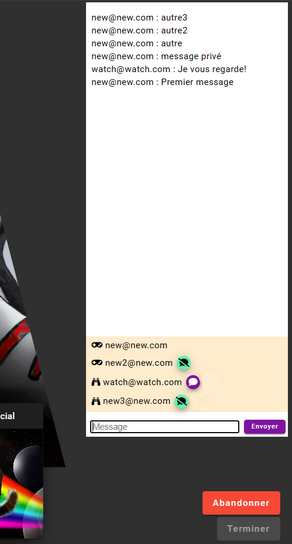

# TP3 (Super suite de Super Cartes Infinies)

## Le projet
Ajouter des fonctionnalités au jeu de cartes développé lors du Sprint 2.

:::info
Vous devez choisir une des tâches suivantes qui sera évaluer de façon individuelle. Vous devez écrire vous-même le code, mais vous pouvez collaborer avec vos collègues.
:::

### Les tâches individuelles
:::warning
La tâche de pouvoirs supplémentaires doit être fait par un autre étudiant que celui qui a fait la logique de jeu au TP2
:::
- **\[Obligatoire\]** Pouvoirs supplémentaires et cartes de sort
- **\[Obligatoire\]** Classement et matchmaking
- Discussion et mode spectateur
- Statistiques

### Contraintes
- Le travail doit être effectué en équipes de 3 ou 4.
- Vous devez utiliser **Git/GitHub**.
- Vous devez utiliser **DevOps** pour la gestion des tâches ET utiliser les **sprints**.
- L'étudiant qui a fait la logique de jeu au **TP2** ne peut pas faire les pouvoirs supplémentaires pour ce TP

### Les étapes et évaluations
Il y a 2 évaluations, mais il est fortement recommandé de terminer les tâches individuelles **au moins une semaine** avant la remise d'équipe :
- Premier livrable d'équipe (Première évaluation)
- Fonctionnalités individuelles
- Merge et dernière fonctionnalité (Deuxième évaluation)

## Premier livrable d'équipe (4%)
- Comme on va travailler en Test Driven Development (TDD). Il faut ajouter au moins un test complet pour chacun des nouveaux pouvoirs. (Voir la première tâche individuelle)
    - Il va falloir faire quelques ajouts au code pour pouvoir écrire les tests. Comme une méthode HasStatus() et GetStatusValue().
- Protèger la branche de développement avec des tests unitaires automatiques et au moins un review pour le Pull Request. (L'appliquer sur la branche où les différentes parties individuelles vont être mergées)

## Tâches individuelles (12%)

<details>
<summary>Pouvoirs supplémentaires</summary>

    Un premier pouvoir "normal":    
    - **Chaos**, inverse l'attaque et la défense de toutes les cartes en jeu. Il se produit avant que la carte attaque. Attention, les cartes avec 0 d'attaques doivent mourrir tout de suite.
    
    Des pouvoirs qui vont **modifier un état**:
    - **Poison X**, qui ajoute une valeur de poison à la carte attaquée. Le poison diminue ensuite la vie d’une carte de la valeur du poison à la fin de son activation. Si une carte a déjà une valeur de poison et qu’elle est à nouveau attaquée, la valeur de poison est augmentée.
    - **Stunned X**, qui empêche une carte d’agir pendant son activation durant X tours. (Mais elle reçoit quand même les dégâts de poison!)
        - Tester que le status "stunned" est présent avec la valeur X ET que la carte avec le status "stunned" n'est pas activée à son tour et que le status "stunned" a diminué de 1.
    
    - Il faut ajouter un système générique de gestion d'état. Un PlayableCard a donc une liste de PlayableCardStatus. Un PlayableCardStatus a une valeur et un Status. Et la classe Status a un Id, un nom, une descrption et un icone. (Bref, c'est similaire à un pouvoir (Power), mais pour les états.). Il faut ajouter un Status Poisoned et Stunned. Il faut également ajouter des méthodes HasStatus, AddStatusValue et GetStatusValue (Encore une fois, similaire à la gestion de pouvoirs).
    - Ajouter des tests unitaires pour les nouvelles méthodes de gestion de status pour vous assurer qu'elles fonctionnent bien avant de commencer a travailler sur les pouvoirs.

    Il y aura également l’ajout de cartes de sorts (Spells) qui auront un effet immédiat et qui se déplaceront directement dans le « graveyard » après avoir été joué (Il faut animer les pouvoirs avant de déplacer la carte vers le Graveyard):
    - **Earthquake X**, fait X dégâts à TOUTES les cartes en jeu (même les nôtres!).
    - **Random Pain**, fait 1 à 6 de dégâts à une carte adverse (au hazard).

    Ajouter également **un pouvoir à votre choix** (Valider avec le Prof!) (vous pouvez ajouter un sort)

    Il faut avoir un seed avec **chacun des nouveaux pouvoirs** sur **au moins une des cartes de départ** (Vous pouvez ajouter de nouvelles cartes de départs)
</details>

<details>
<summary>Classement ELO et Matchmaking</summary>

Pour faire jouer des joueurs avec des forces comparables et avoir un classement des joueurs, on utilisera le système ELO.
C'est un système très connu qui permet entre autres de faire le classement des joueurs d'échecs.

Détails de notre système ELO:
    - Les joueurs commencent avec un score de 1000
    - Après chaque match on utilise la méthode de calcul de ELO (fournie plus bas) qui va mettre à jour le score des 2 joueurs.
      - Le joueur qui a **gagné** voit son score ELO **augmenté**
      - Le joueur qui a **perdu** voit son score ELO **diminué**
  
- Afficher le changement de ELO après chaque Match (Dans le menu de Victoire/Défaite)
- Afficher le ELO du joueur à côté de son argent sur le client
- Utiliser une **background task** pour faire le **matchmaking** qui va s'exécuter **chaque seconde**
  - Contient une liste d'info des players (PlayerInfo) qui attendent présentement (avec leur userId, ELO, temps d'attente)
  - Logique du service de matchmaking:
    - Faire une copie de la liste et appeler GeneratePairs (avec le pseudo code juste après)
    - Démarrer un match pour chaque paire de joueurs
    - Retirer les paires de la liste de players qui attendent
    - On augmente le nombre de secondes d'attente des joueurs qui attendent encore

```
// Passer une COPIE de l'information sur les players (Car on va retirer les éléments de la liste, même si le player n'est pas mis dans une paire)
List<PairOfPlayers> GeneratePairs(List<PlayerInfo> playerInfos){
    pairs = new List<PairOfPlayers>

    // Tant qu'il y a des joueurs à mettre en pair
    while(playerInfos.Count > 0)
        playerInfo = playersInfos[0]
        playersInfo.RemoveFirst()
        smallestELODifference = int.MAXVALUE
        index = -1
        for(i = 0; i < playersInfo.Count; i++)
            pi = playersInfo[i]
            difference = valeurAbsolue(pi.ELO - playerInfo.ELO)
            if difference < playerInfo.attente * CONSTANTE
                if(difference < smallestELODifference)
                    smallestELODifference = difference
                    index = i
        
        // Si on a trouvé une paire
        if index >= 0
            playerInfo2 = playersInfos[index]
            playersInfo.RemoveAt(index)
            pairs.Add(new PairOfPlayers(playerInfo, playerInfo2))
        // Sinon, c'est pas grave, on a retiré l'élément de la liste et on va évaluer le prochain


}
```
:::warning
Il y a une autre raison pourquoi on veut faire une copie de la liste avant de la passer à la méthode GeneratePairs. C'est qu'on veut se protéger du cas où un nouveau joueur s'ajouterait pendant que l'on fait les paires et que l'on risquerait d'avoir des problèmes avec notre logique.
:::

Pour faire une copie d'une liste, on peut simplement faire:
```csharp
var copy = new List<PlayerInfo>(listOriginale);
```

**Note:** Pour ceux qui aime les détails, on va garder l'algorithme de sélection des paires de joueurs assez simple et donner l'avantage aux joueurs qui attendent depuis le plus longtemps!
Donc dans le cas ou les joueurs attendent dans cet ordre: 1000, 1005, 1007, 994. On va chercher l'ELO le plus près de 1000 en premier, trouver 1005 (+5) et ensuite faire la paire 994 et 1007(+13). Même si on pourrait faire 2 meilleures paires: 994 et 1000 (+6) et 1005 et 1007 (+2). (Mais si vous voulez mettre en place un algorithme plus performant, vous êtes les bienvenues!!) 
  
  - Mettre la fonctionnalité de ranking dans un service et écrire des tests unitaires
    - Vérifier qu'il retourne une paire si on a 2 joueurs avec des ELOs assez proche
    - Vérifier qu'il retroune une liste vide si les 2 joueurs ont des ELOs trop différents pour le temps qui a passé.
    - Vérifier qu'il fait retourne les bonnes paires avec un groupe de 6 joueurs et qu'il retourne 2 paires avec les joueurs les plus proches, mais qu'il ne retourne pas la dernière paire qui a des ELOs trop éloigné.

Dans EndMatchEvent, utiliser cette méthode pour calculer le nouveau score des 2 joueurs.

```csharp
public class EloCalculator
{
    public enum GameOutcome
    {
        Win = 1,
        Loss = 0
    }

    public static void CalculateELO(ref int p1Rating, ref int p2Rating, GameOutcome p1Outcome)
    {
        int eloK = 32;

        double expectation = ExpectationToWin(p1Rating, p2Rating);
        int delta = (int)(eloK * ((int)p1Outcome - expectation));

        p1Rating += delta;
        p2Rating -= delta;
    }

    private static double ExpectationToWin(int p1Rating, int p2Rating)
    {
        return 1 / (1 + Math.Pow(10, (p2Rating - p1Rating) / 400.0));
    }
}
```

**Note:** Sans expliquer le détails des maths, le système augmente les points du gagnant et diminue celui du perdant. Si le gagnant avait un grand score par rapport au perdant, le changement est faible (On s'attendait à ce qu'il gagne). Mais si le gagnant avait un score plus petit, le changement est plus important en proportion de la différence.
</details>

<details>
<summary>Discussion et mode spectateur</summary>
- Chat dans un menu sur le côté avec les messages et la liste des gens présent (joueurs et spectateurs)
  - Les joueurs et spectateurs peuvent écrire de messages et on voit qui a écrit chacun des message
  - Si un spectateur est bani, il est sortie de la partie et ne peut plus la joindre (On ne peut pas banir un joueur)
  - On peut également faire Mute, pour ne plus afficher les messages d'un joueur ou spectateur sur notre client pour cette partie

||
|-|

- Un nouveau menu avec la liste des parties actives avec l'option de les regarder (Si on n'est pas un joueur de cette partie)

||
|-|

    - Si il n'y a aucune partie courrante, afficher un texte qui le mentionne.
    - Afficher le nom des 2 joueurs dans le menu des parties actives
    - Il faut ajouter l'option de joindre la partie comme spectateur dans le Hub. La logique devrait ressembler au JoinMatch d'une partie déjà existante.
    - Lorsque l'on joint une partie, on ne peut PAS voir les cartes dans les mains des 2 joueurs, on voit seulement le dos des cartres, comme pour l'adversaire dans un match normal.
    - Il n'y a évidemment pas la possibilité de jouer de carte, ni de terminer un tour ou d'abandonner.
</details>

<details>
<summary>Statistiques des joueurs</summary>
- Un joueur aura la possibilité de voir des statistiques à propos de ses decks ou de l’ensemble de ses cartes
    - Il pourra voir le **nombre de victoire et défaites avec ce deck (ou général)**
    - La distribution des cartes (En utilisant des graphs similaires):
        - Coût
        - Rareté
        - Attaque et défense
- Il faut ajouter le nombre de victoires et de défaites sur Player et le mettre à jour à la fin de chaque match
- Il faut également ajouter le nombre de victoires et de défaites sur Deck et le mettre à jour à la fin de chaque match
- Vous pouvez utiliser la technologie de graph que vous préférez, mais voici une proposition : https://canvasjs.com/angular-charts/pie-chart-index-data-label/
- Si vous utilisez cette technologie, une fois que vous avez réussi à intégrer des graphs avec des valeurs hardcodés, regardez cette exemple pour comprendre comment afficher vos données dynamiquement: https://canvasjs.com/angular-charts/dynamic-live-column-chart/
:::warning
Notre situation est différente de celle de l'exemple, mais l'important c'est de comprendre la partie avec getChartInstance et UpdateChart.
:::
:::warning
Dans votre cas, pas besoin de mettre le data à jour chaque seconde avec un timeout comme dans cet exemple!
:::
- Il faut avoir un seed avec un minimum de 20 cartes différentes avec des valeurs variées à fin de pouvoir bien voir les statistiques des cartes.


#### Lorsqu’on affiche l’ensemble des cartes

||
|-|

#### Lorsque l’on sélectionne un deck

||
|-|
</details>


## Partie Commune Finale (4%)
- Faire le merge des différentes partie
- Faire le déploiement
    - Déployer Angular
    - Déployer WebAPI
    - (**PAS** nécessaire de déployer le serveur MVC)
- Fixer [le problème de mise à jour du match](/info/NgZone)

## Bonus d'équipe (2%)
- Modifier le client pour:
        - Gérer les nouveaux pouvoirs, incluant les sorts
        - Afficher les icônes des nouveaux pouvoirs et les animer pendant les combats
        - Afficher les status d'une carte (poisoned) ou (stunned)

## Grille de correction
- 12% de la note pour l’évaluation individuelle (voir le document sur la correction individuelle)
    - 2% pour l'utilisation d'Azure DevOps Boards
    - 10% pour le code et les fonctionnalités
- 8% de la note pour l’évaluation de groupe
    -	4% pour la première remise
    -	4% pour la remise final
    -   2% pour le bonus

<!--
## Référence pour la remise finale en équipe

Une référence pour voir un client et un serveur fonctionnels.

- 🔗[Client](https://wonderful-tree-0ccc8c610.4.azurestaticapps.net/)

:::info
Vous pouvez simplement utiliser register pour ajouter vos propres joueurs
:::

- 🔗[Serveur](https://supercartesinfiniesTP2.azurewebsites.net/)

:::info
Username: admin@admin.com Le mot de passe: Passw0rd!
:::

-->
